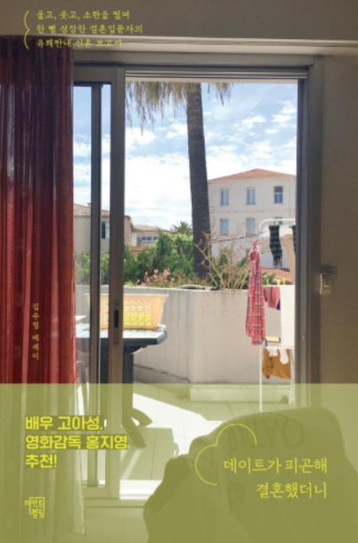

저자 : 김수정

```
삶의 진로를 생각할 때에면 언제나 마주하는 결혼과 아이에 대한 고민이 많은 요즘, audiobook 목록을 훑어보던 중, 눈에 띄는 책을 발견하고 구입했다.
내가 결혼 상대를 고르고, 결혼을 고민할 때 조그마한 통찰을 얻기를 바라며..
책을 듣다보니 결혼에 대한 대략적인 생활이 그려졌다. 
작가는 여성이기 때문에 남자의 시각으로는 잘 알 수 없었던, 여성의 시각으로 바라보는 결혼, 남편, 생각의 흐름을 알 게 되는 것이 꽤나 재미있었다.
```

## 오빠랑 얘기하는 게 제일 재미있어.
나는 남편과의 대화가 재미있어진지 얼마 안되었다. 남편과의 대화에서 재미를 찾기 위해 부단히 노력중이다.
```
대화가 잘 통하지 않는 사람과 결혼을 생각한 것.
부부라도 끊임없는 노력을 해야한다는 것. 
(원래부터 잘 맞기 때문에 결혼한 것은 아니라는 것)
```
이효리 : 나는 이상순과 대화하기 위해 결혼했다.
```
다양한 형태의 부부, 그에 따른 다양한 삶이 있기 때문에 나의 삶과 가치관을 남과
비교할 필요는 없다.
```
남편은 말을 끝까지 듣지 않는다. -> 연애 초반에는 이것이 죽도록 싫었다. 물론 지금도 좋은 것은 아니다.
서로 개그코드도 워낙 맞지 않는다.
```
연애는 커녕 결혼조차 자신과 완벽히 잘 맞는 사람과 하지 않는다. 
죽도록 싫었던 점이 있는 사람과도 만족하고 할 수 있구나.
```

결혼은 자상하고 착한 사람과 하는 것이 최고다. 아무리 재미있고 대화코드가 맞는 사람도 결혼해서 한집에서 같이 사는 것은 전혀 별개의 문제란다.
원래 대화는 가끔보는 친구들과 하는 게 제일 재미있는 법이다.

부부가 되면 친구, 가족도 이해하지 못하는 새로운 카테고리가 생긴다.(둘만의 세상이 생긴다.) 이는 시간이 지나며 점점 확대되어 간다.

## 백수 남자친구가 체력고갈에 끼치는 영향
만났을 당시 작가는 5년차 기자였고, 남자는 30살 백수였다. 그리고 이후 1년동안 백수(취준생)으로 지냈다.
그러고보니 30대의 데이트란 참 재미없고 빤하다.
```
모두가 그런거니 만약 내가 지금(30대)에 연애를 하면서 단조롭고 지겹게 느껴진다면,
그것은 무언가 잘못된 것이 아닌, 당연한 것이다.
```
몸이 피곤하니 마음이 건조해졌다.
남자친구와의 대화가 조금만 어긋나도 저 깊은 곳에서 화가 몰려왔다.
```
다들 똑같구나.. 특정 부분에서 짜증을 느끼게 되는 것은 누구에게나 당연한 일인 것 같다.
이를 어떻게 대처하고 극복하느냐가 중요한 것이다.
```
함께있어도 혼자 있고 싶은 날이 많아졌다.
그 즈음 헤어짐을 이야기했다.

결혼의 좋은점?
데이트를 안 해도 되는 것
퇴근 후 각자 생활을 꾸릴 수 있는 여유(데이트 시간대신)
함께 생활리듬을 맞춰가는 기쁨
집앞에서 헤어짐의 아쉬움을 느끼지 않아도 되는 기쁨
외식대신 집에서 입맛에 맞는 요리를 해먹는 기쁨
```
애인과 데이트하는 것이 귀찮고 데이트시간이 아깝게 느껴진다면
(하지만 그 사람자체는 너무 좋다면)결혼하는 것도 방법이 될 수 있겠다.
```

## 대체 사이드메뉴는 왜 시키는건데

연애초반 통장 잔고가 남아있던 시기에는 남편도 돈을 펑펑 썼다. 외식도 지독히 좋아했다.
```
그런 사람들도 많다.. 나만 별난 것은 아니야.
하지만 나는 개선하고 있고 바뀌고 있다.
```
남자친구가 사이드메뉴(라지, 닥터페퍼, 나초칩 등..)를 시키는 게 그렇게 꼴보기 싫었다.
```
내가 속초에서 느꼈던 감정과 스트레스들..
일을 하고 있는 작가조차 그런 감정이 든다는 것은 빚이 있는 내게는 너무나 당연한 
감정이었구나..
```

## 프로포즈까지 쫒아온 징크스
결혼해야 돈이 모인다는 말은 사실이다.
돈에 대한 가치관 자체가 달라진다.

## 자격지심 첫 경험
나보다 잘난 누군가를 애써 찾아 부러워하며 나를 열등감으로 억죄는 일련의 과정.
하지만 부러워하는 것은 이상한 일이 아니다.

남편의 첫사랑이 너무 잘난 사람이라 자격지심을 느꼈다.
결혼하지 못하는 이유가 모든게 내 탓 같았다.
```
내가 보기에는 아무 것도 아닌 것 같은데, 
여자들은 이런 사소한 것에도 질투를 하고 민감하게 반응하는구나.
```

하지만 남편이 보여준 복잡미묘한 표정과, 내가 그에게 있어 큰 의미를 갖는다는 사실을 깨닫고 자격지심은 사라졌다.
```
자신이 남자친구에게 얼마나 중요한, 소중한 존재인지를 확인받고 싶어하고, 그것이 
자존감에 매우 큰 영향을 미친다는 것..
```
## 동거를 했더라면
동거를 했다면 결혼 전에 포기했을 것이다.
동거 전 보였던 단점을 매일 마주해야했고, 3년 간 보이지 않았던 단점들이 속속들이 보이기 시작했다.
전세대출, 혼인신고를 하지 않았더라면 주안에 포기했을 거다.
```
배수의 진, 환경의 중요성 
-> 버티다보면 반드시 환경이 바뀌고 적응하고 나아지는 순간이 온다.
이는 결혼뿐 아니라 인생 전반에 대한 진리이다.. 하지만 단순히 버티는 것이 아닌,
상황을 개선하려는 노력이 필요하겠지.
```
제아무리 다툼 없는 부부라도, 가슴에 응어리진 것 하나쯤은 있을 것이라고 확신한다.

## 기분포물선
기분 리듬이 맞는 날에는 더없이 행복하고 결혼을 잘했다는 생각이 든다.
```
이런 사소한 걸로도 그런 생각을 하다니.. 
사소한 것에 신경을 써서 이런 생각을 자주 하게 만들어줘야겠구나.
```

```
어떤 커플이든 경제 상황이 악화되면 돈때문에 사울 가능성이 있다.
그런 상황에도 싸우지 않을 수 있는 사람이라면 베스트이지만 애초에 이런 상황을 
만들지 않는 것이 현명한 것.
```

```
여자는 본능적으로 결혼을 하며 그 가정을 잘 가꾸고 싶어하는 본능이 있기 때문에 
(+가정을 돌보는 것조차 너무 바쁘고 벅차기 때문에) 
완벽한 이상형의 사람이 달려들어도 귀찮을 뿐이다.
(근데 아직 몇 년 지나지 않은 부부라 그럴지도 모른다.)
```

    