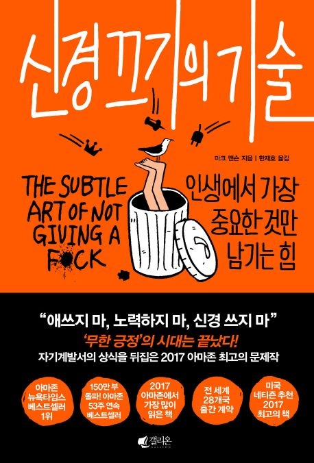

### 행복
행복이라는 것은 내가 선택한 과정의 고통을 기꺼이 감내해야만 성추치할 수 있는 것이다. 성취된 결과(보상)를 사랑하고, 그 과정(투쟁)을 사랑하지 않는다면 아무것도 성취할 수 없다.

### 문제
삶이란 본래 문제의 연속이다. 문제없는 삶을 꿈꿀 수 없다. 다만, 좋은 문제로 가득한 삶을 꿈꿔야한다.

### 행복과 문제
행복은 문제를 해결하는 데서 나온다.
문제를 회피하거나 없는 척하면 불행해지고 만다.
해결 못할 문제가 있다고 생각해도 불행하진다.
행복은 가만히 있으면 주어지는 것이 아니다.
문제를 해결하라.

### 고통
부와 마찬가지로, 고통도 목적이 없다면 아무런 가치도 없다.

모든 것에는 고통이 있다.
부자는 부로 인해 고통받고, 가난한 자는 가난으로 인해 고통받고, 가족이 있는 자는 가족으로 인해 고통받는다.

다만 모든 고통이 동등한 것은 아니다. 어떤 고통은 덜 고통스럽고, 더 고통스러울 수 있다.

부처 : 고통과 상실을 피할 수 없으니, 저항하려는 마음을 버려라.

내가 선택한 고통이 나를 만들어간다.
```
나는 급하지 않지만 중요한 일들을 매일 선택해서 나를 쌓아 갈 것이다.
당장 눈에 보이지 않는 결과를 위해 이를 매일 반복하는 것은 고통스럽고 
지겨운 일이 될 것이다. 이 또한 내가 선택한 고통이다.
항상 즐거운 일을 할 수는 없다. 다만 과정을 즐기고 그 안에서 행복을 찾아가자.

박진영
인생은 짧게 보면 도움이 되지만 길게보면 도움이 되지 않는다.
인맥을 위해 술자리, 만나고 싶지 않은 사람들을 따라다니기보다는 스스로의 실력을 높이는데
투자하라.
짧게 보면 재능이 있는 사람이 유리하지만, 길게 보면 반복되고 지겨운 일(고통)을 
매일 이겨내는 사람이 성공한다.
내가 부족하다고 항상 겸손, 겸허하고 주변인의 단점을 보는 것이 아닌, 장점을 보고 
감사할 줄 아는 사람이 되는 것.
나를 낮추면 모든 것이 감사하다.
나를 높으면 모든 것에 불만이 생긴다.

싸이
싸이조차 데뷔 전 2년간 단 한장의 앨범을 팔지 못했다.
그는 포기하기 전에 자신이 할 수 있는 모든 것을 다 해보자라고 생각하고 방송사 복도에서
춤을 췄다고 한다. 
성공한 사람들 그 누구도 고통의 시기를 이겨지지 않은 사람이 없다.
고통은 필연적인 것이다. 
미치면 이기고 지치면 지는거다. 길게 봐야한다.

```

---
바람둥이의 삶을 살았지만, 아름다운 여성들도 만났지만, 짜릿한 쾌감을 맛본 시기였지만, 그 시기는 우울했고 불행했다.
직작을 여러 번 잃고 친구들을 잃었다.
내가 가보지 못한 길이 좋아보일 수 있지만, 모든 길에는 부정적 측면과 부작용이 있다. 우리는 이 사실을 생각하지 않고 항상 즐거운 일들만 생각한다.
-내용 중

---

절대, 당연히 라는 것은 없다.
어떤 현사이든 일어나기 마련이고, 그 것을 평가하는 기준은 내 안에 있는 기준이다.
그렇지만 그 '당연'이라는 기준이 좋지 않거나 더 나은 기준이 있다면?
우리는 우리가 가지고 있는 기준때문에 스스로 고통받을 필요가 없다.
```
나는 올해로 32살이 되었고, 아직도 일을 시작하지 못했다.
하지만 이게 스트레스 받는 일이라는 것을 누가 정했지? 
바로 외부에서 학습한 내 안의 기준이다. 
나는 그냥 현재를 충실히 살아가며 스스로 정한 목표만 바라보고 가면 될 뿐이다.
내가 지금 슬픈 것은 세상이 정한 기준에 나를 비교하며, 내가 거기에 부합하지 않기 
때문일 것이다. 괜찮다. 그런 것은 아무 것도 중요하지 않다.
내가 그것을 어떻게 받아들이느냐가 중요한 것이다.
내가 가진 것에 집중하자. 남과 비교하지 말고 남의 잣대를 나에게 들이밀지 못하게 하라.
```
### 높은 기준
높은 기준의 목표는 노력과 성공에 도움이 되지만, 내가 충분히 성공하고 훌륭함에도 나 자신을 불행하고 부족하게 느끼게 할 수 있기 때문에 현재 가진 것에 감사하고, 또 만족하고, 행복을 느끼는 것이 무엇보다 중요하다.

### 자신에 대한 잣대
나를 행동이 아닌 사회적 지위를 나타내는 상징물로 평가하면 사람이 천박해지고, 천하의 몹쓸놈이 되기 십상이다.

### 무한 긍정
무한 긍정의 태도는 좋지 않다.
부정적인 감정을 받아들이지 않으면 더 깊어지고 오래가며, 장애를 일으키고 만다.
무조건적 긍정은 회피일 뿐, 문제에 대한 해결책이 아니다.

문제를 풀어야 행복을 얻을 기회가 생긴다.
이러한 측면에서 문제는 삶의 의미와 가치를 더한다.

### 가치
좋은 가치란 
1.현실에 바탕을 두고
2.사회에 이로우며
3.통제할 수 있는 것이다.
ex)모임에서 모두에게 친절한 태도를 취하겠어 -> 내가 통제할 수 있고, 현실적인 가치.
나쁜 가치란
1.미신적이고
2.사회에 해로우며
3.직접통제할 수 없다.
ex)모임에서 모두에게 사랑받겠어 -> 미신적이고, 나의 통제를 벗어나는 가치


세속적 가치에 기준을 둔다면, 그것을 달성한 순간 동기를 잃고 무기력해진다.

### 삶을 바꾸는 가치
1.책임감
2.내가 100%올다는 확신을 내려놓기.
3.거절 -> 거절을 통해 내 삶에서 무엇을 받아들일지 명확히 정의하고, 상대방의 거절도 받아들일 수 있어야 한다.

---
윌리엄제이스는 30살까지 무직이고, 자살을 생각했다.
하지만 죽기 전에 1년 간만 죽을 정도로 최선을 다 해 보고, 현실이 변하지 않으면 그 때 죽기로 결심한다.
그는 이 결정을 계기로 세계에서 존경받는 석학의 자리까지 오르게 된다.
->늦은 때는 없다.. 포기하는 사람과 현실에 안주하는 사람이 있을 뿐.

---

당연하게도 모든 사건을 통제할 수 없다.
다만 그것을 어떻게 해석하고, 어떻게 대응하느냐는 100%우리의 몫이다.

```
내가 '키'라는 가치를 선택하고 열등감을 느끼면, 그것이 나의 삶을 지배하는 가치가 된다.
하지만 내가 가지고 있는 다른 가치를 선택하면 나는 당당하고 자신감을 갖고 살 수 있다.

```

사람들은 부정적 감정이 들면 그 감정을 마비시키는 데 몰두한다.
자신을 속이거나 엉터리 가치관으로 돌아가서라도.
(내가 게임에 빠져 일본에 가지않고 편함을 선택한 것과 같이.)

새로운 가치관을 들인다는 것은 새로운 고통을 들이는 것이다.
그 과정을 받아들이고 즐겨라.


### 무기력할 때
동기가 생기지 않을 때에는 일단 행동하라.
행동은 자극을 낳고, 동기를 낳는다.