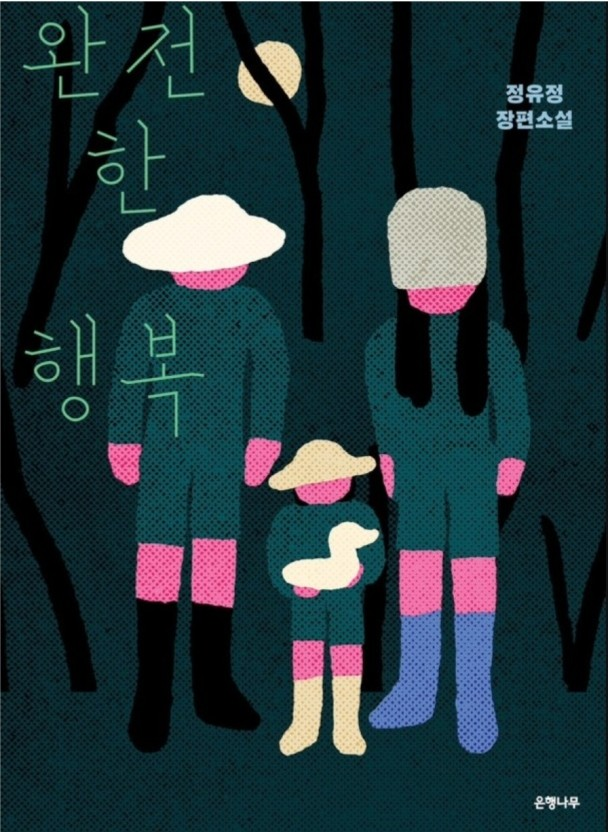

책소개나 리뷰를 보지 않고 제목만 보고 오디오북으로 구매한 책.
출퇴근 자전거를 타며 틈틈히 들었다.
첫 한~ 두 시간 정도는 이게 무슨 책인건지, 내용도 재미가 있는지도 전혀 모른 채 삭제할까 고민을 많이했다.
그러다 살인사건이 일어나고 본격적인 이야기가 시작될 때부터는 가슴을 두근두근하며 집중해서 들었던 것 같다.
그 후로는 홀로 일본생활에 재미와 활력을 주는 요소 중 하나가 된 책이다.

장르는 스릴러?인 것 같은데.. 솔찍히 무슨 내용을 전달하고 싶은지는 잘 모르겠다.
다만 이 책을 읽을 때에는 내가 패턴이 무너지고 스스로에 대해 자존감이 많이 낮아져있을 때였는데,
이 책에 나오는 불행한 인물들의 삶을 보며 내 삶이 최악이 아니라는 위로를 받았던 것 같다.
이러한 생각을 한다는 것 자체가 죄책감이 들고 스스로의 인격과 그릇에 대한 실망이 들지만
이미 삶을 살아가며, 바닥을 몇 번 치면서 나라는 사람은 타인을 진심으로 걱정하고 기뻐해주고 축하해주기 위해서는
나 스스로가 먼저 자신의 삶에 만족하고 있어야 하는 사람이라는 것을 알게된 뒤로는 오히려 이러한 감정들을 이용해서
내가 그런 사람이 될 수 있도록 노력하는 방향으로 나아가려 하고있다.

행복은 덧셈이 아니라 뺄셈이다 라는 여자 주인공의 말이 기억에 남는다.
완전해질 때까지 불행의 가능성을 없애가는 것 이라는..

글쎄.. 대다수의 마음 수양이 안 된 사람들에게는 그게 맞는 듯 하다.
결국 행복은 덧셈으로 인해 무한 증식할 수 있다고 생각하지만
마음에 큰 짐이 있거나 인생에 큰 고민이 있으면 보통 사람은 그곳에서 벗어나기 힘들기 때문이다.

큰 걱정과 고민, 불행이 없는 상태에서야 비로소 대부분의 사람들은 행복을 덧셈으로 만들 수 있는 것 같다.

하지만 내가 직장을 다니면서 초기 사장님으로 인해 정말 큰 스트레스를 받았을 때에 느낀 것은, 당시에 내가 감사하고 행복하다고 느낄 만한 요소들이 매우 많았음에도 불구하고 고통에 치중하는 자신을 보며, 필연전 고통은 찾아오기 마련이며 결국 인생에서 행복으로 가는 유일한 방법은 그러한 고통을 내 삶의 포커스에 중심에 두는 것이 아닌,
다른 수많은 감사할 것들에 초점을 맞추는 것이었다.

그리고 그 고통을 야기하는 원인에 대해 최선을 다하고, 그 이상의 내가 통제할 수 없는 부분은 받아들이고 신경쓰지 않는 것, 현상 이상의 나쁜 가능성에 대해 걱정하지 않는 것이야 말로 중요한 부분이라는 것을 느꼈다.

지금 내가 지금까지 많은 시간을 낭비하고, 이미 나이도 젊지 않다고 느끼고, 삶에서 이룬 것이 별로 없다고 느끼며 앞으로의 인생에 대해서도 걱정을 느끼고 있으며 좌절할 때,
결국 내가 나아가고 삶이 행복해질 수 있는 방법은 지금까지 내가 해온 것들에 이어지는 앞으로의 미래에 대한 막연한 걱정과 불안이 아닌 현재부터 내가 할 수 있는 것들에 대해 초점을 맞추고 그것을 하나 씩 성취해가는, 그럼으로서 그 모든 것들을 계획대로 이루어나갈 때 그려지는 미래를 보며 나아가는 것이다.

지금의 나는 이러한 불행 이야기를 읽으며 스스로의 삶을 위로받는 상황이지만..
2025년은 내가 계획한 모든 것을 성취하여 타인을 진심으로 축하해 줄 수 있는 사람이 되려고 노력할 것이다.

그리고 앞으로는 제대로 책 설명을 보고 사야지.