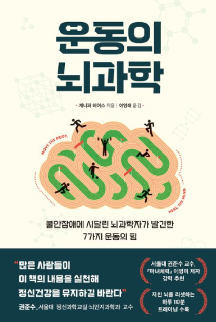

내 인생을 바꾸어준 책.
내가 방황할 때 가장 큰 힘이 되어준 책.

깨달음 요약 정리

### 의지
의지는 결정을 미룰 수록 약해지고, 결국 사라지기 때문에 반드시 **계획**을 세워 방지해야 한다.

### 운동
운동을 갑작스러운 미팅, 시간날 때 하는 것으로 치부하면 뇌는 절대 그것을 허용하지 않을 것이다. 반드시 계획에 포함이 되어있어야 한다.

#### 좋은 스트레스와 나쁜 스트레스.
너무 힘든 운동은 나쁜 스트레스가 나온다. 너무 쉬운 운동은 좋은 스트레스가 나오지 않아 성장하지 못한다.

#### 내성
운동스트레스 내성이 증가하면 운동을 즐기게 된다.

#### 운동 강도
운동을 시작할 때 첫 몇 번의 운동 강도에 따른 감정이 이후 동기부여에 큰 영향을 미친다.
운동이 너무 힘들면 강도를 낮추라. 꾸준히가 가장 중요하다.

#### 학습된 무기력과 운동
통제할 수 없는 스트레스가 반복되면(만성 스트레스) 자기효능감이 낮아지고 시도조차 포기하게 된다.

운동은 학습된 무기력을 벗어날 수 있는 힘(추진력)을 제공한다.
정신력을 키우고 스트레스를 낮춰준다.

#### 음악
운동을 할 때에는 강하고 일정한 템포의 음악을 들으면 도움이 된다.

#### NPY 
NPY란 스트레스 탄력성을 말한다. 우리를 저신적 스트레스에서 보호해준다.
이는 일주일에 3번, 3분씩 낮은 강도의 운동으로도 생성이 된다. 그 이상의 운동을 해도 생성량은 변함이 없다.

#### 우울
강도에 상관없이 운동과 항우울제는 같은 효과를 갖는다.

#### 운동의 작용 원리
운동을 시작하면 대비가 된 상태로 염증반응이 유발되고(항상성 파괴)
이후 운동이 끝나면 대비대로 몸은 염증을 청소하는 세포를 보내는데, 이 세포는 기존에 있던 부정적 염증도 함께 청소하여 몸이 건강해진다.

#### 운동을 하지 않자 
건강했던 통제집단은 2주간 정적인 생활을 한 뒤 우울감에 시달렸다.

#### ㅁ유산소와 무산소
유산소는 지속시간, 무산소는 강도와 밀접한 관련이 있었다.

### 노시보 효과
부정적인 믿음은 실제로 부정저긴 물리적 효과를 야기한다.

### 호흡 
호흡에 집중하면 불안을 다스릴 수 있다.
뇌는 한 번에 한가지 일에만 집중할 수 있기 때문 -> 번뇌를 잊게 한다.
ex)요가 명상 등...

### 우울감
약한 우울감은 오히려 상황을 개선하는데 도움이 될 수 있다.(반드시 부정적인 것이라고 생각하지 말라.)

### 도파민과 행복

작은 일에 스트레스를 받으면 행복지수가 내려가고, 우울해진다.
도파민의 총량은 무한하기 때문에, 항상 감사하고 작은 일에 행복을 느끼는 것이 인생이 행복해지는 방법.

---
도파민은 평상세에도 뇌에서 분비되고 있으며, 정상적으로 분비되는 수준을 베이스라인이라고 한다. 문제는 현대 사회 도처에서 쉽게 얻을 수 있는 쾌락적 자극들은 도파민을 지나치게 분비되도록 유도하고 있으며, 이것이 결국 평상시의 분비 수준을 베이스라인 이하로 떨어뜨리는 결과를 야기한다는 것이다. 우울해지면 다시 쾌락에 집착하게 되며, 이는 앞으로 과정이 반복되는 악순환을 낳는다.

여기서도 우리는 도파민이 총량을 유지하지 않는다는 사실을 알 수 있다.
결국 일시적인 도파민보다 베이스라인을 올리는 것이 훨씬x10 더 행복해 진다는 것.

나쁜 도파민에 지속적으로 노출이 되면 베이스라인이 떨어지고, 결국 총량은 급감하게 된다. -> 삶의 질 하락.

반면 기분이 좋고, 사소한 일에 감사하고 행복을 느끼는 사람은 베이스라인이 올라가 엄청난 차이를 만들어 낸다는 것.

---

### 도파민
도파민의 총량은 정해져있지 않다.
다만 부정적인 도파민에 노출되면 부작용이 반드시 오게 된다.

도파민이 과하면 조현병이 올 수 있고, 너무 강한 도파민에 노출이 되면 일상에서 도파민이 분비되지 않아 우울이 온다.

도파민은 보상자극과도 같아서 부정적 도파민에 노출이 계속되면 부정적 도파민을 방출하는 부정적 행동을 반복하게 된다. ex)마약, 게임 등

도파민 = 의지력, 실행력

하지만 '의지'는 또 다른 것이다.

도파민 소비 이후에는 힘든 일을 할 의지가 남아있지 않게 된다.
=>즉, 하기 싫고 힘든 일을 먼저 끝내야 한다는 것.
상상만으로도 도파민이 분비된다.

### 계획과 도파민
계획에서 도파민은 두 번 분비된다.
1.계획을 세울 때 2.계획을 달성했을 때.
->길고 어려운 목표를 세우면 금방 동기가 사라진다.
짧고 꾸준히 달성하도록 단계적으로 나아가는 것이 중요하다.

### 중독행위 탈출 이후 유지
1.물리적 단절
2.제한적 사용
(어절 수 없이 사용할 때에는 제한을 정하기)
3.대안적 약화
(하위 개념으로 상쇄하기 ex)롤 -> stream게임, 다만 steam게임에 큰 흥미와 중독을 느끼지 않는다는 가정하에.)

1.환경통제(물리적 단절)
2.매일매일 작은 성공을 성취하라
(도파민 결핍의 뇌에 도파민을 불어넣어 동기부여 해주기.)
자기통제와 성취는 '좋은 도파민'을 증가시킨다.
- 노력 전 도파민 활성화는 최악(즉각적 보상)
- 노력 후 도파민 활성화는 차악(무기력감 유도)
- 노력 자체에서 도파민을 느끼는 것은 최상(과정을 즐기는 것)

3.나쁜 도파민 빈도를 줄이고 랜덤하기 사용하라 -> 100% 끊지 못할 때 최대 효율 (매일 같은 루틴과 환경이 아닌, 변화를 시도해 도파민에 익숙해지지 않도록 한다.)
4.한 번에 한 가지 일만 한다.
(ex. 게임을 하며 유튜브를 보고 초콜릿을 먹으면, 도파민 수치는 미쳐 날뛰게 되고, 반동으로 도파민 결핍은 매우 커지게 된다 -> 중독에 매우 취약한 상태가 된다.)
- 중독은 그것을 떠올리는 것만으로도 중독 재발 가능성이 있다.
- 한 번 중독에 걸리면, 노출되기만해도 재발 가능성이 높다.
최대한 접근도 하지 말자. 한 번만 하다가 빠지는 경우가 상당히 많았다..

### pain찾기
생산적이고 긍정적인 고통을 유발하여 반동으로 평시에 행복감을 느낄 수 있다.
고통이 없다면 행복도 없다.

### 정체성
내 스스로에 대한 정체성을 정하는 것이 매우 중요하다.(자아상) 
나의 행동은 스스로 결정한 자아상에 따라 행동하기 때문이다.

### 계획/목표를 세울 때
계획을 세울 때
{언제 + 어디서 + 어떤 행동을 할 것이다.}라고 반드시 구체적으로 작성해야 한다. 
또한 계획이란 스스로와의 '약속'이다.
ex)친구가 한 잔 하자고 금요일 저녁에 부른다. -> 계획이 있다. -> 친구에게 선약이 있다고 말할 수 있어야 한다.
우리는 타인과의 약속을 지키기 위해 노력하지만 스스로의 계획에는 관대하다. 그러면 안 된다.
계획이란 스스로와의 약속이며, 반드시 지키는 것.

목표를 세울 때
내가 좋아하는 환경, 장소에 가서 하는 것도 동기가 올라온다.
(이미 그 장소에 있는 것만으로 보상, 도파민 -> 의지력↑)

### 운동과 도파민
운동시 baseline의 130%의 도파민을 분비한다.
만족스러운 식사 시 : 130%의 도파민
즉, 운동은 간식보다 만족감이 훨씬 크고, 매일 만족스러운 식사를 하는 행복감을 느낄 수 있다.

### 엔돌핀
젖산역치를 넘기는 운동을 하면 5분 후 생성되기 시작해, 운동을 그만둔 뒤 20분동안 남아있는다.
운동이 나에게 힘든 강도로 올라가면 고통이 커지며 엔돌핀도 함께 커진다.
하지만 너무 힘든 강도는 고통만 커지고 더 이상 엔돌핀이 증가하지 않는다.
->즉, 한계가 느껴지지 않는 선에서 힘든 강도가 베스트이다.

### 나이
나이는 마음의 문제.
아직 오지 않은 최악의 삶을 상상하며 행복하게 사는 것은 불가능한 일이다.

### 운동과 숙면
"숙면"은 운동이 주는 가장 큰 선물이라고 할 수 있다.

잠들기 4시간 이전 운동은 수면에 도움을 준다.
1시간 전 운동은 부정적 영향을 미친다.
다만 심박수를 일정 이상 높이지 않는 운동(경보 등)은 영향을 미치지 않는다.

### 수면부채
운동은 수면 중 수면부채를 값는 뇌파의 지속시간을 늘려준다.
※수면부채 : 하루 필요 수면을 충족하지 못해 발생

### 수면예금
수면예금이 가능하며, 이는 수면부채가 발생했을 시 회복력에서 엄청난 차이를 보였다.
※수면예금 : 하루 필요 수면 이상을 충족한 경우 발생

### Ram수면
Ram수면은 뇌가 하는 오락이며, 정서기억을 정리해, 감정의 고통을 덜어낸다. (Ram수면을 통해 기분이 훨씬 나아진다.)

### 운동을 가는 것이 부담스러울 때
오늘은 가볍게 몸만 풀고 오자. 라고 생각하고 간다. 몸을 움직이기 시작하면 활력이 돌아온다.
교차훈련을 하면, 몰입을 쉽게 할 수 있게 된다.
※교차훈련 : 한가지+틀에박힌 운동과 활동이 아니라 새로운 거을 추구하고 스스로 다양한 방법을 시도할 수 있는 환경.

### 계획과 사고방식
목표 중심의 사고방식과 목표에 집중하는 것은 (살을 빼겠다 등) 과정을 즐기지 못하고, 실증나게 만든다.

반면 과정에 집중한다면 더 재미있고 오래 지속할 수 있다.

또한, 목표 중심 사고방식은 목표를 달성했을 때 이후 오는 허탈감이 강하다. ex)steam게임 최종보스를 공략하면, 더 이상 하고싶지 않다.