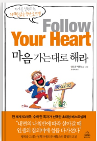

저자 : 앤드류 매튜스
번역 김유경

세이노의 가르침에서 추천도서로 나온 책.
그래서인지 세이노의 가르침의 교훈과 어느정도 겹치는 부분이 있다.

## 시련이 왜 필요할까?
### 인생은 고통스러운 시련의 연속인 걸까?
꼭 그렇지만은 않다. 우주는 언제나 상냥하게 신호를 보낸다. 그 신호를 무시할 때 쇠망치가 날아오는 것이다.
시련에 저항할수록 성장하기 가장 아픈 법이다.

우리는 성공을 기뻐하지만, 성공에서 배우는 것은 적다.
일이 틀어질 때 우리는 큰 깨달음을 얻곤 한다.

성공한 사람들은 "내가 하는 생각과 행동을 어떻게 바꿔야 할까? 어떻게 해야 지금보다 더 나은 사람이 될까?
패배자들은 모든 경고 신호를 무시한다. 지붕이 무너져내려도, 불평과 투덜거릴 뿐이다.

우리는 습관의 동물이기 때문에 변하도록 "강요"해야 기계적으로 하던 행동을 멈춘다.

## 우리는 매 순간 교훈을 얻을 수 있다.
삶은 내게 필요한 교훈의 연속이야. 늘 알맞은 상황에 주어지지.(크나큰 마음의 평화를 보장하는 가장 건강한 사고방식.)

```
리나가 집에 온 것은.. 지금 내 인생에 있어서 부족한 부분을 배우고 채울 수 있는 기회이다.
나는 다른 사람들을 수용하고, 함께 가는 것을 항상 어려워 했다.
남을 내 기준대로 비판하고 바꾸려고 하지 말고, 있는 그대로를 받아들이고 포용하는 능력을 길러야 한다.
스트레스를 받는 상황에서도 남을 배려하고, 웃는 연습, 스스로를 행복하게 하는 연습을 해야한다.

특히, 결혼을 하면 행복할 때에도 많지만, 정말 불지옥같은 경우도 많이 올 것이다.
나는 그럴 때마다 도망치고 혼자가 될 것인가?

해당 상황을 내면의 기준을 반전시켜서 받아들어고 스스로 행복해지는 연습을 해야한다.

이 상황은 나에게 매우 좋은 기회이며, 더 좋은 사람이 될 수 있는 기회가 된다.
```

★우리의 행복에 그 사람이 걸림돌로 느껴지겠지만 실제 걸림돌은 우리 자신이다. 왜냐하면 사람들은 우리가 어떻게 보는지에 따라 달라지기 때문이다.★ 
```
정말 정말 정말 맞는 말...
사람이 문제가 아니다.. 그들을 바라보는 내 기준과 시선이 그 사람을 아니꼽게 만들 뿐이다..
장점을 찾아서 칭찬하고, 감사하는 연습을 하는게 어떨까..
```

- 내 상사는 위선자예요. 그는 소름 돋는 짓을 멈춰야 해요. 이건 내 잘못도 아닌데 무슨 교훈을 배워야 하죠?
-> 그를 소름 끼치는 위선자라생각하는 한 그는 그런 인간으로 남을 수밖에 없다. 생각은 자유다. 하지만 변하기로 마음먹는다면, 즉 그의 장점에 눈을 돌리고 비판하는 걸 멈추고 더 나아가 그를 이해하려고 한다면 문제는 간단히 사라질 것이다. 어떻게 하냐고? 가능성은 얼마든지 있다.
1. 그가 나의 태도 변화에 응답하여 마음을 열 수 있다.
2. 그가 다른 부서로 옮겨 갈 수 있다.
3. 당신이 다른 직장을 구할 수 있다.
4. 그가 좋아질 수도 있다.

나의 변화는 주변을 바꾼다. 단, 내 변화가 진심에서 우러나와야 한다. 
"참아는 보겠지만 프레드가 얼가이인 건 사실이에요."라고 말한다면 그건 내가 완전히 변하지 않았다는 뜻이다.

```
나는 배선배님을 그냥 있는 그대로 받아들였다. 비판하려고 하지 않고, 그냥 어려운 사정이 있던 사람이구나 하고.
그러니까 안 좋은 감정이 생기지 않고 욕하지 않았다.
오히려 그의 장점을 생각했다.

그런데 왜 나에게 가까운 사람에게는 자꾸 그러지 못하고, (있는 그대로를 받아들이지 못하고) 바꾸려고 하고, 아니꼬와 하는 거지..? 
왜그럴까...
결국 그들은 바뀌지 않았고, 다툼만 생겼을 뿐이다..
나와 다른 점에는 눈을 감고, 좋은 부분만 보려고 노력해야 겠어.
```

### 교훈은 지구 끝까지 쫓아온다.
우리가 시련에서 아무 교훈도 얻지 못하다면 시련은 끝나지 않는다. 시련에서 벗어나고자 어디론가 떠나려 할 때, 비행기에서 내리자마자 시련이 우리를 기다리고 있을 것이다.
```
문제를 도피할 때, 그 문제는 반드시 따라온다.
내가 집에서 매일 자고, 게임을 하는데, 환경만 변화하면 돼 라고 생각한다면 나는 배우는 것이 아무 것도 없이 도망치는 것이다..
이번에 나 스스로를 다스리는 방법을 배우기 시작한 것은 나에게 큰 힘이 될 것이다..

->정말 그래..
비자때문에 안됐다고?
그냥 그런 상황을 맏닥뜨렸을 때, 나의 자질이 부족해서 그런 상황으로 간 것 뿐이다.
다른 누군가는 그 상황에서 최선의 행동과 결과를 도출했을 것이다.
항상 내가 부족하고, 배울 점을 생각해야 한다.
```

## 삶은 배움의 장
아내가 당신을 화나게 한다면, 분노에 효과적으로 대응하는 법을 연습하는 계기로 삼자.
그걸 익히는 걸 도와줄 가장 훌륭한 상대방이 집에 있지 않나. 아내가 연습 상대가 될 수 있다. 얼마나 다행인가!

인생은 사다리와 같다. 올라가기 위해선 한 계단씩 제대로 올라가야 한다.
곤경에 빠졌다면 스스로에게 물어보자. "내가 어떤 계단을 밟지 않은 거지?"
```
상황을 탓하는 것이 아닌, 모든 것은 나로부터 바꿀 수 있다는 관점을 가지고 간다.
그것이 상황 자체를 바꾸는 것이든, 그 상황을 받아들이는 나를 바꾸는 것이든.
```

### 그럼 어떻게 해야 미치지 않을 수 있을까?
절대 "...을 다 할 때가지 쉬거나 즐길 수 없어."라고 절대 말하지 말아라. 그냥 편안하게 그 과정을 즐겨라.
끊임없이 물어라. "여기서 배울 점이 뭐지?"

"내가 지금 행복할 수 없는 이유는 ~ 때문이야. 하지만 다음 달에는... -> 다음달 : 독감에 걸림, 사소한 안 좋은 일이 끊임없이 일어남..
->"내년에는... "  
결국 인생은 쉬워지지 않고, 완벽하게 가는 경우는 거의 없다. 
내가 행복해질 수 있는 유일한 방법은 나중을 기약하는 것이 아닌 "바로 지금에서 이러한 상황속에서도" 행복하지는 방법을 찾아야 한다.
```
결국 내가 교훈을 배우지 못한 곳에서 발생한 문제를 관통한다.
코로나->이것만 끝나면...
일본비자 -> 비자만 나오면...
결국 행복이든 어떤 일이든, 지금 바로 시작하지 않으면 영원히 반복될 뿐이다.

특히 지금같은 상황에서도 그래.
리나만 집에 돌아가면 행복해질 것 같나?
아니. 틀렸어.

리나가 집에 돌아가도 새로운 문제는 늘 존재하고, 삶의 불만은 늘 존재한다.

단 한가지 내가 행복해 질 수 있는 방법은
현상을 긍정적으로 받아들이고, 배움의 장이라고 생각하며, 현재에서 행복을 찾는 방법 뿐이다..
```

# 2장 우주는 편애하지 않는다.

## 씨앗의 법칙
사람들은 종종 이 법칙을 잊는다.
그들은 말한다. "오늘 콩을 심으면 내일 뭘 받게 될까?
답은 "젖은 콩"이다. 씨앗의 법칙은 "오늘 심고 나중에 거두어라"라고 말한다.
지금 콩을 심으면 4개월 후에나 콩을 따게 된다.
```
이제 막 한두달 깃허브를 엸미히 했다고 왜 이력서가 통과하지 않지?
->정답 : 한 두달은 개나소나 할 수 있으며, 그것이 이어지지 않는다면 오히려 역효과가 날 수 있다.

오늘의 나를 보라. 얼마나 교만한가..
겨우 2~3달 열심히 해놓고 월급이 왜 오르지 않았냐고..?
이제 막 콩을 심어놓고서 나무가 자라기를 바라는가.?

꾸준히. 2년은 열심히 해야 대가가 돌아온 다는 것을 명심하라.

솔찍히 너 이번년도에 죽을 각오로 열심히 한다고 해놓고, 뭐했냐
집에서 퍼자고 인스턴트 음식 먹고..

남들은 5~6년을 앞서갈 때 너는 저 멀리 뒤쳐졌어.
지금부터 5~6년 간 죽어라 해도 그 갭이 메워질까 말까인데,
겨우 3달하고 대가를 바란다고?
정신차려라..
```

## 모든 결과에는 원인이 있다.
좋은 일이 일어나지 않는다면 순전히 자신의 잘못이다.
```
환경 탓 하지마라.
모든 것은 내 잘못이다.
리나가 학원다닐 비용을 나에게 지원받을 수 있던 것을 놓쳤지만
전혀 그 사실을 모르듯이,
내가 노력하지 않으면 전혀 눈에 보이지 않는 기회들이 지나가버린다.
그것은 행복일수도, 직업적 커리어일수도, 연애일 수도 있다.
따라서 매 순간, 매 초를 최선을 다해서 살아야 한다.
```

## 자기 훈련이 인생에 차이를 만든다.
자기 훈련의 핵심은 강철 같은 의지가 아니다.
바로 무언가를 왜 원하는지 그 이유를 아는 것이다.
빚에서 벗어나고 싶은 진짜 이유를 안다면 저축이 쉬워진다.
본인의 역량을 키워야 한다는 확신이 들 때 공부하기가 쉬워진다.
```
결국 저자도 사람의 의지가 아닌,
내적 동기를 활성화하여 행위를 지속할 것을 기대하고 있어.
```
스스로 훈련하지 못하는 사람은 흔히 명령을 들어야 하는 직업을 갖게 된다.
자기 훈련을 전혀 하지 않는 사람은 팔다리가 꽁꽁 묶인 것이나 다름없다.

```
자기훈련이란..인생 계획을 세우고 내가 원하는 것을 눈에 보이도록 하여 내적 동기를 유지하는 것..
그것이 훈련이다..
그것은 훈련없이는 유지할 수 없는 것이다...
그것은 내가 자기 전에 자기 피드백을 해야 하는 이유이며
끊임없이 목표를 상기하고 되내어야하는 것이다..
```

## 노력은 배반하지 않는다.
영하 50도에서 꽁꽁 얼린 얼음 한 조각에 열을 가해 녹여 보자.
처음 얼마간은 아무 일도 일어나지 않는다.
아무리 많은 힘을 가해도 결과가 눈에 보이지 않는다.
그러다가 갑자기 0도에 이르면서 녹아서 물이 된다.
계속 해보자. 다시 한번 많은 힘을 주지만 여전히 반응이 없다.
그러다가 약 100도에 다다르면 물이 끓기 시작하면서 공기 방울이 생기고 수증기가 나온다.
법칙? 얼음, 프로젝트, 경력 따위에 많은 에너지를 소비해도 아무런 진전이 없어 보일 수 있다.
하지만 보지 못할 뿐이지 이미 변화는 만들어지고 있다.
계속해서 에너지를 넣다 보면 분명히 눈에 보이는 변화가 생길 것이다.
이 법칙을 기억해야 공포나 절망에 빠지지 않는다.
```
매우매우 중요한 이야기..
성장과 성과는 계단식으로 이어진다.
반드시 그 사실을 기억하고 꾸준이 지속해야하며,
외적 동기가 아닌 내적 동기를 유지해야 이러한 상황이 지속되었을 때 
지속할 힘을 지닐 수 있다.
```
이 노력들은 즉각적인 결과를 바라기보단 과정을 즐기는 데 도움이 된다.
게다가 가장 기대하고 있지 않을 때, '빙고'가 터진다.
새로운 기회, 초대장, 수표가 날아온다.

# 3장 우리는 믿는 대로 살게 된다.

## 믿는 대로 된다.
스스로 유리 새장을 만들고 그걸 현실이라고 인정해 버린다.
하지만 그건 단지 믿음에 불과하다.
```
절대, 한계라는 건 없다.
모든 건 그것을 믿는 그 사람에 의해 한계가 생길 뿐이다.
나는 된다.
나는 가능하다.
나는 모든 것을 이룰 수 있는 의지가 있고 지혜가 있다.
```

## 내 스토리는?
중대한 사실을 고지하겠다.
우리는 스토리에 얽매이지 않아도 된다.
어차피 아무도 신경 쓰지 않는다.
우리는 상자나 틀에 박힌 존재가 아니다.
일련의 경험을 해 나가는 인간이다.
스토리에 질질 끌려다니는 걸 멈추고나면 더 이상 정해진 역할을 찾으려고 두리번거지리 않아도 된다.
```
나는 30대이다. 나는 일을 해야한다.
일을 오랫동안 하지 못하고 있기 때문에 불행하다 등..
내가 스스로를 억압하고 있는 사실이었따.
모든 사람은 각자의 인생이 있고, 그 가치를 판단 할 필요는 전혀 없다.
그저 현실에 감사하며 충실하게 살면 된다.
```

## 어떤 믿음을 버려야 할까?
'해야 한다'는 단어가 들어간 믿음은 경계하자.
- 사람들은 호의를 돌려줘야 한다.
- 사람들이 나를 칭찬해야 한다. 내가 일을 잘하는 걸 남편이 알아 줘야 한다.
- 사람들은 사랑을 돌려줘야 한다.
- 사람들은 좀 더 사려 깊어야 한다.
- 사람들은 감사할 줄 알아야 한다.
이러한 '해야 한다' 목록은 합리적인 기대의 집합처럼 보인다.
그런데 만약 우리에게 어떤 믿음도 없다면 어떨까?
사람들이 동조하지 않고, 호의를 돌려주지 않고, 잘한 일을 알아주지 않고,
사랑을 돌려주지 않아도 된다면 우리 삶이 어떻게 변할까?
그렇다고 해서 덜 존중받거나 덜 인정받지는 않는다.
사람들이 이런 일을 하지 않아도 우리는 여전히 즐거울 수 있다.

현실은 '해야 한다'와 관계없이 움직이기 때문에 '해야 한다'는 믿음은 별로 도움이 되지 않는다..!!
현실은 그런 믿음과는 상관없이 흘러간다.
그렇다고 현실을 비난해 봤자 언제나 현실이 이긴다.
```
모든 불화의 갈등은 상대방으로부터의 기대와 '해야 한다'는 마음에서 나온다..
그들에게 실망하고 화가나는 것은 '그는 당연히 이런 식으로 행동해야 한다.'라는 생각에 출발한다.

더 나아가, 내가 나의 목을 조르는 것이 
'나는 항상 잘 해야 한다. 나는 질책을 받으면 안된다. 나는 실수하면 안 된다.'
등의 거짓된 믿음이 있다.
정말 아무 것도 아닌 걸로, 그냥 큰 소리 들었을 뿐인데
나는 심장이 두근두근대고 몇 시간이나 진정이 되지 않았다.

그 이유는 무엇인가..?
'나는 항상 잘해야하며, 사장님에게 혼나지 않아야 한다. 실망을 시키면 안 된다.'
라는 거짓된 믿음이 있기 때문이다.
그래서 그 믿음이 배반된 순간 나는 상처받고, 주저앉고 훨씬 더 크게 힘들어진다.

사장님이 나에게 화를 내도 괜찮다.
누군가 나에게 화를 내도 괜찮다.
사람은 누구나 실수할 수 있고, 완벽한 사람은 없다.
그리고 나에게 더 너그럽고 자비로워 질 필요가 있다.
잘못한 것은 쿨하게 인정하고. 다시 그러지 않으면 된다.
그것을 오래 끌고가는 것은 나를 파괴하는 일이다.
```
다음번에 화나는 일이 생긴다면 내가 화가 나는 건 내 믿음 때문이라는 것을 기억하자.
어떤 생각이 우리를 고통스럽게 할지라도 그건 생각일 뿐이다.
그리고 우리는 그 생각을 바꿀 수 있다.

## 돈을 불러오는 금전 철학

### 월급이 정해져 있는걸요
월급을 받건 안 받건 믿음이 성공을 만든다.
같은 회사에 다니고 같은 월급을 받는 8명의 사람들이 있다.
어떤 이는 자산을 만드고 잘 사는 한편, 다른 사람드은 고작 샌드위치를 사 먹을 때도
은행에서 돈을 빌려야 한다.
차이점은 그들이 버는 돈이 아니라 돈에 관한 믿음에 있다.
내게 필요한 만큼의 돈이 없거나 돈을 잃고 있다면 거기에는 이유가 있다.
그 이유는 외부가 아니라 내부에 있다.
복권 당첨자들은 믿음이 어떻게 성공을 좌우하는지 보여 주는 확실한 증거다.
우리는 돈이 많은 문제를 해결해 줄 거라고 생각한다.
하지만 많은 복권 당첨자들은 수표를 받기 전보다 뜻밖의 횡재가 있은 지 2년 후
더 많은 빚더미에 올라앉는다.
왜일까? "나는 언제나 파산 상태야"라고 말하는 믿음이 백만 달러를 순식간에 압도하기 때문이다.

## 호사를 누려라

세상이 날 대접하길 바랃나면 스스로를 잘 대접하라.
구멍 난 속옷을 입고 어떻게 거물이라고 느끼겠는가?
프레드가 말한다. "팬티에 구멍이 나도 괜찮아. 아무도 보지 못할 테니까."
하지만 말이야 프레드. 자네가 아고 자네 몸이 느끼고 있잖은가.
자ㅏ신을 특별한 존재로 만들 수 있는 유일한 사람이 바로 자네야.
자네에게 자긍심이 없다면 아무도 자네를 자랑스러워하지 않아.
우리가 사는 집 또한 우리의 기분에 영향을 준다.
문을 열고 들어서자마자 기분이 좋아지는 공간을 만들어라.
스스로의 색깔로 집을 꾸미자.
```
주위 환경을 변화시켜 나의 무의식을 긍정적으로 변화시키자.
```

# 4장 사람이든 돈이든 무언가에 집작하는 순간, 그것이 우리를 거꾸로 옭아맬 것이다.

### 초연함 대 무관심
무관심한 사람들은 말한다.
"누가 상관한다고 힘들게 그래?"
절박한 사람들은 말한다. "이걸 해내지 못하면 죽어 버릴 거야."
초연하면서 단호한 사람은 말한다.
"어쨋든 좋은 직장을 구할 거야. 얼마나 오래 걸리든 상관 없어."
```
이번에 깨달은 것..
올인하지말고 집착하지말고 안되더라도 그 다음의 일을 생각하면 된다.

올인하지 말라.
집착하지도 말라.
보내줘라.
그래고 플랜 a,b,c를 항상 염두에 두어라.
```

"이게 아니라도 행복할 수 있다"고 말하자.
잊고 전진하다 보면 대개는 좋은 결과가 찾아올 것이다.

### 집착과 증오
증오는 잘못된 선택이다.
무언가를 증오하는 동안 우리는 무언가와 보이지 않는 실로 연결되어 그 주위를 맴돌게 된다.
```
실로 맞는 말..

나의 잘못된 믿음에서 출발한 분노가 
증오가 되고, 그 증오가 나를 옳아매서 내 삶을 행복하지 않게 만들었다.
나는 그것에서 벗어나지 못하고 속에서 화가 쌓여만 간다..

사람을 용서하라..
원수도 용서하라..
그거 나를 현재 적대하지 않는 한,
과거는 지나간 일일 뿐이다..
왜 그것에 집착과 미련을 가지며 나 스스로를 힘들게 하는가.
```

# 5장 우리가 집중하는 것이 확장된다.

## 왜 긍정적으로 생각해야 할까?
무의식은 모든 생각의 집합체이다.
가장 흔한 생각들이 가장 강한 무의식적 행동으로 발현된다.

패배자는 불가능한 것에 집중하다 보니 그들의 눈에는 불가능한 것들만 보인다.
긍정적인 사고방식을 가진 사람들은 가능한 것을 생각한다.
가능성에  초점을 맞추다 보니 실제로 이루어 낸다.
```
긍정확언의 힘.
나는 된다.
나는 성공한다.
지금 힘든 길을 가더라도, 나는 내가 성공에 도달할 것을 알고 있다.
```

생각을 가다듬는 일은 평생이 걸린다.
방대한 작업이다.
하물며 자신이 부정적인 상태에 있으면서도 종종 그걸 알지 못하기 때문에 더 어렵다.

