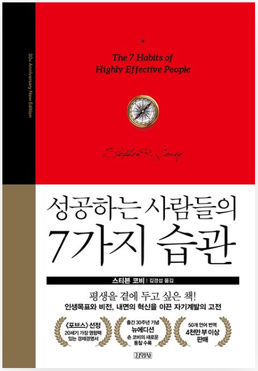

성공하는 사람들의 7가지 습관


# 내면으로부터 시작하라

내면적 가치에 근거한 동기를 갖게 되자 온갖 새로운 감정이 솟아나기 시작하였다.
즉, 우리 아이를 다른 아이들과 비교하고 판단하는 대신 있는 그대로이 모습을 좋아하는 우리 자신을 발견하게 되었다.
```
내게 필요한 가치인 사람을 그대로 받아들이는 것..
관용의 영역에도 해당하지 않을까 ?
```
나와 아내는 우리 아들이 이뤄낸 '사회적 으로 대단한' 성취가 사회적인 보상이나 인정을 목표러 했기 때
문이라기보다는 아이가 스스로 자신감을 갖게 되면서 이룰 수 있었다고 믿는다.
```
사회적 인정을 목표로(외적 동기)하는 것이 아닌 내적 동기에 초점을 맞췄을 때,
외적보상은 자연스럽게 따라오게 된다.
```

성품이 결점투서잉이고 이중적이고 불성실한 사람이 자신이 원하는 대로 다른 사람을 행동하게 하고
이전보다 좀더 열심히 일하게 하고 더 큰 동기를 가지게 하며 
자신을 좋아하고 나아가 서로가 좋은 관계를 갖도록 하기 위해 각종 전략과 기법을 사용한다면,
이는 장기적으로 보아 실패할 수밖에 없다.
왜냐하면 나의 이중성은 불신을 낳게 되어 내가 하는 일은 무엇이든 ㅡ
심지어는 소위 좋은 대인관계기법을 활용하는 것조차도 의도가 깔린 것으로 상대방이 인식하기 때문이다.

```
내가 다른 사람에 친절을 배풀 때에는,, integriry가 통일된 상태가 아니라면, 나는 그것을
근본적으로 행하는 것이 아니기 때문에 반드시 어딘가에서 모순이 발생하게 되며,
상대도 그것을 알아차리게 된다. 그러면 나는 그것을 행하지 않았을 때 보다도 
신뢰를 잃게된다.
결국은 내 내면의 가치를 바꾸는 수밖에 없다.. 
```
그 설득법이 아무리 뛰어나고 훌륭하다 해도 아무런 소용이 없다.
따라서 신뢰와 믿음이 없다면 지속적인 성공의 토대가 없는 셈이다.
기본적으로 선한 품성을 갖추고 있을 때 이 같은 기법도 쓸모 있게 된다.

```
각종 전략들은 내가 그것을 특정 목적을 위해 꾸미지 않았다는 것이 입증될 때에 효과적이다.
그렇다면 우리는 그 전략을 사용하기 전에 먼저 진심으로 그런 사람이 되기 위해 노력해야 한다.
```

그러나 이 같은 이차적 특성들은 오랜 관계를 유지하는 데는 결코 영구적인 가치를 가지지 못한다.
결국 깊은 성실성과 내적 성품의 근본적인 강인함이 없으면 잉ㄴ생에서 맞게 되는 여러 가지 도전으로
인한 위기 상황에서 내면의 동기와 의도가 드러나게 마련이며 단기적인 성공은 인간관계에서의
완전한 실패로 대체될 수밖에 없다.

결국 우리의 어떤 말이나 행동보다 훨씬 더 설득력 있게 우리 자신을 전달해주는 것은 성품이다.
우리는 이 같은 사실을 모두 알고 있다. 
예컨대 그 사람의 내적 성품을 잘 알고 있기 때문에 절대적으로 신뢰할 수 있는 사람이 있다.
이런 경우 우리는 그 사람이 달변이든 아니든 대인관계 기술이 훌륭하든 그렇지 않든 그 사람을 믿으며
그들과 함께 성공적으로 일한다.

10초라는 시간이 우리가 사물을 보는 방식에 이처럼 큰 영향을 주는 것을 볼 때,
일생 동안 우리의 인생에 영향을 미치는 것들 ㅡ 가족, 학교, 교회, 직장, 친구, 동료,
성격 중심의 사고 같은 현 사회의 패러다임 ㅡ 은 모두 소리 없이 우리가 전혀 의식하지 못하는 
상태에서 영향을 미칠 뿐 아니라 우리의 준거틀, 패러다임, 사고의 지도를 형성하는 데도 영향을 미친다는 
것을 알 수 있다.
여기서 든 사례는, 이러한 패러다임이야 말로 우리의 태도와 행동의 근원임을 보여준다.
패러다임을 벗어나서 언행이 일치하도록 행동할 수 없다.
보는 것과 다르게 말하고 행동한다면 완벽한 인격자가 될 수 없다.
만일 당신이 잠깐 동안 주어진 조건에 의해 젊은 여자라고 주장하게 되는 집단에 속하는 경우(90% 이상이)
이 집단에 속함
그녀가 길을 건너갈 때 부축해줘야 한다는 생각은 하지 못할 것이다. 왜냐하면 그녀에 대한
당신의 '태도'와 '행동'은 당신이 그녀를 '본' 방식에 일치하도록 되어 있끼 때문이다.

앞의 예는 외적 성격 중심의 사고가 갖는 근본적인 약점 중 하나를 설명해준다.
만일 우리가 태도와 행동의 원천인 패러다임을 검토해보지 않고 단지 밖으로 드러난 태도와 행동만 바꾸려고
노력한다면 이것은 장기적으로 보아 별 도움이 되지 않는다.

```
이것은 정말 핵심을 꿰뚫는 이야기이다.
왜냐하면 다양한 책을 보고, 스킬을 습득한다고 해도, 그것들이 실질적으로 내 
내면의 패러다임과 맞지 않으면 나는 그것들을 근본적으로 행할 수 없기 때문이다..
즉, 어떤 책을 볼 때 그것에 대한 깊은 이해와 통찰이 필요하며 
그것을 내면화 하는 시간과 노력이 반드시 필요하다.
즉, 내가 그것을 '왜' 행해야하는지 근본적으로 이해하고 있어야 한다.
```

우리는 사물을 볼 때 있는 그대로를 본다고 생각하는 경향이 있다.
즉, 자신이 객관적이라고 생각한다. 그러나 사실은 그렇지 못하다.
우리는 세상을 있는 그대로 보는 것이 아니라 어떤 것의 영향을 받고 조건과 된 자신의 주관적
입장에서 본다. 다시 말해서 자신이 본 것을 서술한다는 것은 사실 자기 자신, 자기의 지각, 자기의 패러다임을 서술하는 것이다.

```
이러한 관점을 이해하는 것은 다른 사람이 나와 다른 생각, 반응을 이해하는 데 도움이 된다.
그는 같은 것을 보아도 패러다임의 차이로 인해 '근본적으로' 나와 다른 경험을 하고 있는 것이다..

사람들은 흔히 같은 공간에 있으면 같은 것을 경험했다고 착각하고, 
타인이 다른 말을 할 때 그들을 오해한다.
실제로는 같은 것을 경험하고 본 것이 아닌 것을..
자신의 창을 통해 바라보기 때문에 다른 사람은 다른 경험을 하고 있다는 것을 반드시 이해하고 접근해야 한다.
```

자신의 기본적인 패러다임, 사고의 지도, 가정, 사회 경험 등에 영향을 받아온 정도를 더 명확히 인식하면 할수록 이러한 패러다임에 대해 더 큰 책임감을 느끼게 되어 그것을 깊이 검토하고 실체에 실험해보려는 노력을 기울이게 된다. 다른 사람의 의견을 더욱 경청하고 그들이 갖는 시각을 더 개방적으로 받아들일 수 있게 됨으로써 우리는 시야를 넓힐 수 있을 뿐 아니라 훨씬 더 객관적인 견해도 갖게 된다.

### 관점과 존재
우리의 관점을 변화시길 때 동시에 존재 자체를 변화시키지 않는 다면, 그 변화에는 한계가 있으며 그 반대의 경우도 마찬가지이다.
내가 지하철에서 겪었던 패러다임의 전환 역시 나의 기본적인 성품에서 나온 결과였으며 그것에 의해 한계지워진 것이었다.
지하철에서 갑자기 진짜 상황을 파악한 승객들 중 어떤 사람은 그 남자에게 약간의 동정심과 막연한 죄책감 이상의 감정을 갖지는 않았을 것이다.
반면 사려가 깊은 사람은 처음부터 그 남자에게 보다 심각한 문제가 있음을 인식하고 그를 이해해주며 내가 말을 꺼내기 전에 그를 도와주려고 했을 것이다.
```
외적 관점을 변화시키려고 노력해도, 내 성품(내적 관점)이 따라주지 않는다면 한계가 있다.
깜과 중식을 갔을 때에, 종업원이 인상을 찌푸린 상태로 불친절 했었다.
그 때 나는 불쾌하게 생각했지만, 깜은 "이런 더운 날씨에 서있는 다면 누구든 힘들고 짜증이 날 수 밖에 없다."라고 이야기했다.
그것은 깜의 시야가 나보다 넓었으면 내적 관점이 따라주었기 때문에 가능한 발상이었다.
나와 깜은 같은 것을 보았지만 다른 것을 떠올렸으며 받아들이는 것도 달랐다.
```

### 성장 및 변화의 원칙
질문을 하거나 아직 모른다는 사실을 선생님께 말해서 자신의 현재 수준을 알리지 않는 한 우리는 배우지도 발전하지도 못한다.
아는 척은 언젠가 반드시 탄로남으로 오랫동안 그렇게 할 수도 없다.
자신의 무지를 인정하는 것이야 말로 배움의 첫 단계에 해당된다.
```
무지를 인정해야 한다.
내가 레바논에서 내 부족함을 숨기려하지말고 인정하고 가르침을 청했다면 훨씬 더 발전할 수 있었을 것이다.
무지는 부끄러운 게 아니다. 그걸 숨기려고 하는 순간 부끄러워지는 것이고, 발전하지 못하는 나 자신이 스스로 부끄러운 일이다.
무지를 인정하고 배우려는 자세를 청한다면, 사람들은 그것을 비웃는 것이 아니고, 오히려 자신의 지식을 드러낼 기회를 갖게 되어 
기뻐할 것이다.
```
또한 나는 가르쳐야 할 때와 가르치려고 시도하지 말아야 할 때가 있음을 알게 되었다.
관계가 틀어져 있고 서로의 감정이 팽팽하게 대립되어 있을 경우 가르치려는 시도가 자칫하면 비판이나 무시의 형태로 받아들여진다.

```
이건 진짜 진짜 진짜 돈주고도 사지 못할 가르침이다.
나는 항상 리나와 싸웠을 때 그를 가르치려고 해왔다..
근데 솔찍히 그게 먹힌 적이 거의 없다.
내가 그를 비판한다고 느꼈을 것이고, 변명책을 먼저 생각했을 것이다..
감정이 상해있을 때에는, 남의 잘못을 지적하지 말자. 훈계하지 말자.
```
그러나 사이가 좋을 때 조용히 아이 혼자만 데리고 어떤 내용을 가르치거나 가치에 대해 얘기하게 되면 아이가 이를 긍정적으로
받아들여 훨씬 더 큰 영향력을 발휘할 수 있다.

### 우리가 문제를 보는 방식이 문제다.
무엇인가 다른 새로운 시간관리 방법이나 세미나가 이런 고민을 좀더 효율적으로 해결해주리라고 보는 것이다. (x)
그러나 효율성만이 정답이 아닐 가능성이 있지 않을까? 
즉, 더 적은 시간을 투입하여 더 많은 것을 이루는 것이 과연 변화를 가져다줄 수 있는가?
단지 사람들과 상황에 대해 반응하는 속도를 증가시킴으로써 내 삶을 좀더 잘 통제하고 있다고 느끼게하는 건 아닌가?
내가 보다 깊고 원천적으로 생각해보아야할 무언가가 있지는 않을까?
즉, 내 시간과 인생 그리고 나 자신의 본질을 바라보는 방식을 좌우하는 나의 패러다임에 문제가 있는 것은 아닌가?

우리의 결혼 생활은 이제 권태기에 들어섰다. 더 이상 서로 다투지도 않으며 서로에 대한 애정도 거의 남아 있지 않다.
우리 부부는 함께 상담을 받기로 하고 여러 가지 다른 시도도 해봤다. 그러나 우리가 과저에 가졌던 사랑의 감정을 다시 회복할 수 있을 것 같지는 않다.

이 문제를 외적 성격 위주의 고나점에서 보면 내 배우자가 나를 좀더 잘 이해할 수 있는 바업을 가르쳐주는 어떤 세미나나 새로운 책이 반드시 있을 것이다. 그래도 해결이 안 된다면 다른 여자와 새로운 관계를 맺는 것만이 내가 필요로 하는 사랑을 제공해줄 것이라고 본다.
그런데 실제 문제를 가진 것은 나의 배우자가 아닐 수도 있지 않을까?
내가 배우자의 약점을 감싸주지 못하고 상대방의 행동에 따라 나도 똑같이 대응해가며 살아가는 것은 아닐까?
나의 배우자, 결혼생활 그리고 진정한 사랑이 무엇인가에 관해 내가 가진 어떤 기본적인 패러다임에 문제가 있는 것은 아닐까?