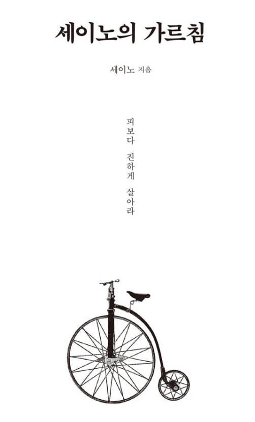

## 삶이 그대를 속이면 분노하라
### 나의 썩어 빠진 삶에 분노하라
당신이 삶이 분노할 대상임에도 분노하지 않는다면 이미 당신의 뇌는 썩어 버린 것이다. 차라리 강물에 빠져 죽어버려라. 하지만 이제라도 삶이 당신을 속인다고 생각되면 그 삶을 던져버려라. 명심해라. 당신이 분노해야 할 대상은 이 세상이 아니다. 당신의 현재 삶에 먼저 슬퍼하고 분노하면서 'NO!'라고 말하라. 그리고 당신의 삶을 스스로 끌고 나가라. 당신이 주인이다.

### 피와 땀과 눈물과 시간 없이는 아무 것도 얻을 수 없다.
편안하게 빨리 돈을 벌고 싶어서 애를 태우는 자들이여. 평생 가난의 괴로운 숯불이 이마 위에 올려지는 저주를 받을 것이다. 피와 땀과 눈물과 시간 없이 무엇을 얻겠다는 것인가.

### 삶의 태도(기준)을 바로 세워라.
당신이 스스로 삶에 대한 태도부터 바로 세우지 않는 한 절대 부자가 될 수 없다.
자기 삶의 노예가 되어 자기 생활과 시간을 통제하지 못하는 사람이 어떻게 돈의 주인이 될 수 있단 말인가.

분노하라. 분노를 느끼는 사람만이 닫힌 문을 세게 쾅쾅쾅 두드릴 수 있다.

시간을 소중히 여기고 피 튀기듯 노력하라.


### 자신을 학대하지 말고, 불쌍히 여기고 보살펴라
너 자신을 죽이고 싶다면 그 죽이고 싶은 인간을 머릿속에서 끄집어내어 제삼자 입장에서 살펴보아라. 불쌍하고 가련한 모습이 아마 하나둘이 아닐 것이다. 길거리에서 그런 사람을 만난다고 치자. 어떻게 할 것인가? 칼로 찔러 죽이겠나? 아니면 이런 사람도 있구나, 불쌍하구나, 생각하면서 뭔가 이끌어 주고 도와주고 싶어질까? 아마 후자일 것이다. 바로 그 마음을 너 자신에게 가져라. 너 자신을 불쌍히 여기고 보살펴라.

## 천재 앞에서 주눅 들지 말라

### 너도 부자 될 수 있다.
실망하지 말라. 돈은 '1%의 영감을 타고난 천재'만 벌 수 있는 것이 아니다.
천재들의 이야기에 주눅 들 필요가 없다는 것이다.

### 돈버는 게임은 보통 사람들과의 게임임을 명심하라.
돈을 번다는 것은 다른 보통 사람들과의 게임이지 당신보다 크게 잘난 사람들과의 게임이 아니다.
예컨대 당신이 보통 사람이라면 하버드를 수석으로 나온 사람과 경쟁하게 될 까닭은 없지 않은가.

머리 좋다는 사람들은 거의 다 학교나 연구소 혹은 법조계나 의료계 도는 유명 기업들에 있다. 이 얼마나 기쁜 사실이냐. 서울대 이공계 수석 입학생들의 80%이상은 나중에 교수가 돼 있었다는 보고서도 있다. 이 역시 범재들에게는 너무나도 다행한 일 아닌가! 당신이 보통 사람이라면 교수나 의사 혹은 변호사와 경쟁할 까닭은 없지 않은가.

**부자가 되는 데는 신이 내린 어떤 재능이 필요한 것도 아니고 학별도, 배경도, 자격증도 큰 도움이 안 된다.
부자가 되는 길을 걷고자 한다면 그것을 빨리 깨달아야 한다. 결국 그것은 다른 보통 사람들과의 게임일 뿐이다.**
보통사람들과의 게임이기에 그렇게 어려운 것이 아니다.
**그저 우리는 우리가 속한 분야에서 다른 보통 사람들과 경쟁하여 이기면 되는 것일 뿐이다. 그들이 놀 때 놀지말고 그들이 잠잘 때 잠을 덜 자고 그들이 쓸 때 덜 씀으로써 목돈을 준비하고 기회를 찾으면 된다.**

당신 주변 일반 사람들은 그저 일확천금을 꿈꾸면서 연예인이나 정치인, 스포츠 선수들, 컴퓨터 게임, 채팅, 명품 브랜드, 경마 등에 무지 관심이 많다. 당신이 하는 게임은 바로 그런 사람들과 하는 것이다. 기억하라. 이것 역시 당신에게는 춤을 추고 싶을 정도로 너무나도 기쁘고 다행한 사실이라는 것을.

그런 적들과 싸울 대는 총도 필요 없고 그저 활이나 창만 있어도 이길 수 있지 않겠는가. 거창한 그 무엇도, 번쩍번쩍한 학벌도, 대통령 친척과 친하게 지내는 배경도, 많은 자본도 필요 없다는 말이다. **이 사실을 빨리 깨달아라.**

## 스트레스의 뿌리를 없애라
나는 누가 시킨 일이건 아니건 간에 일을 해결할 능력 배양에 언제나 최선을 다한다는 점이다. 그리고 그 능력 배양은 언제나 **일과 후**에 있었으며 **노는 날이라곤 거의 없이 삼십 대를 보냈었다.**

아마도 당신은 노는 날들을 악착같이 다 찾아 먹어 왔을 것이다.
```
정말 그렇다.. 나는 생일, 신년, 연휴 등 수많은 핑계를 대며 놀고 쉬어 왔다..
```

## 실패하면 제로 점으로 내려가라
낮은 곳에서 삶을 체험하여야 나중에 경제적 문제에 부딪혔을 때 지혜롭게 헤쳐 나갈 수 있음을 나는 지금도 믿는다.

중산층이나 상류층에서 태어나 비교적 안정된 호나경에서 자라난 사람들은 실직이나 투자 실패 등으로 인한 경제적 곤랸을 겪에 되면 대부분 빚을 내려고 한다. 그러면서 그들이 살았던 생활 수준보다 현저하게 낮은 곳으로는 내려가려고 하지 않는다. **바로 그것이 문제다.**
```
바로 나다..
나는 비빌 언덕이 있었기 때문에 너무 힘들고 고통스러운 일은 피하고 항상 부탁해서 문제를
해결해 왔다... 하지만 이제 밑바다긍로 가는 것, 고생하는 것을 두려워 하지 않겠다.
```

요행수를 바라거나 무엇인가에 쫓기며 하는 투자는 언제나 허무하게 끝나기 마련이다. 생활비를 극도로 줄이고 자신의 몸값을 비싸게 만드는 방법을 모색하면서 아내의 도움을 받아 밤에 포장마차라도 해야한다. 
->궁지에 몰렸을 때의 자세.

제로 점에서 살게 되면 모든 것이 플러스의 희망으로 쌓여만 간다. 돈이 쌓이고 희망이 쌓여 간다. 빚이 있는데도 삶의 질과 품위를 유지하려고 들면 그 빛을 갚아야 하기 때문에 돈은 쌓이지 않고 희망은 갉아먹힌다. 마이너스의 희망뿐이다. 그것이 절망이다.

## 미래를 미리 계산하지 마라
아무리 깊이 떨어져도 우리를 산산조각으로  부서뜨릴 절망이란 이 세상에는 없다는 말이다. 우리를 파괴시키는 것은 우리 자신일 뿐이다.
-> 우리가 스스로를 포기하고 파괴하지 않는 한, 아무리 깊은 절망속에서도 솟아날 수 있다.

우리는 왜 절망하는 것일까? 미래의 상황을 현재의 처지에 비추어 미리 계산하기 때문이다. 지금 일류대를 못 다닌다고 해서 10년 후에 성공하지 못할 것이라고, 지금의 빚을 5년 후에도 못 갚을 것이라고, 지금의 봉급으로는 평생 남들처럼 못 살 것이라고 미리 계산하여 체념한다.

부자가 되려면 미래 방적식에 지금의 처지를 대입하면 절대, 절대, 절대 안 된다. 결코 그런 짓을 하지 말라.
```
항상 긍정 확언과, 이미 이루어 진 자기예언을 입버릇으로 들이자. 그리고 그것을 믿자.
```

그러므로 미래를 미리 계산하여 절망하는 어리석음을 버릭 그저 이 순간부터 당신의 미래 언젠가에 무슨 일인가가 새로 일어날 수 있도록 책을 읽고 지식을 축적하라. 절대로 '내가 이걸 배워서 어디다 써먹겠어? 내가 이렇게 한다고 해서 무슨 소용이 있겠어?' 하는 따위의 생각은 추호도 갖지 말라. 그것 역시 미래 방적식에 현재의 시간을 대입시키는 어리석은 짓이며, 패자들이 즐겨 사용하였던 핑계에 지나지 않는다.

단, 조건이 있다. 뭘 배우든지 간에, 뭘 하든지 간에, **미친 듯이 피를 토하는 마음으로 제대로 하여라.** 그렇게 할 때에야 비로소 미래는 그 암흑의 빗장을 서서히 열어 주기 시작할 것이며 조만간 그 빗장 너머에서 비치는 강렬한 태양빛 아래에서 당신은 감격의 눈물을 흘리게 될 것이다.

이미 그렇게 몇 년째 살아왔음에도 변화가 없다면 당신은 그저 삶의 번호를 잘못 찍는 바람에 길을 잘못 들었을 뿐이다. 그 잘못된 길에서 절망하지 말고 빨리 깜빡이를 켜고 길을 바꾸어라. 내 말을 믿어라. 거기서 새 삶이 무섭도록 빠르게 달려온다.

'내가 이렇게 한다고 해서 과연 세이노 말처럼 될까' 하는 끊임없는 의심이 있다. 왜 사람들은 내가 이미 실제로 경험한 것을 말해 주는데도 믿지를 못할까? 정말 이러한 의심은 미래를 미리 계산하여 보아야 직성이 풀리는 가난한 자들의 공통적 특성이다. 승자는 일단 달리기 시작하면서 계산을 하지만 패자는 달리기도 전에 계산부터 먼저 하느라 바쁘다.

## 건강을 잃으면 모든 것을 잃는다고?
일과 관련된 공부를 할 때는 피를 토하는 자세로 하라. 특히 삼심 대 중반 이전에는 적어도 2~3년 동안은(길면 길수록 좋다) 그렇게 살아야 한다고 말한다. 

**길거리에서 허비하는 시간이 없어야 하므로** 최대한 일터나 학교에 가깝게 살면서 시간을 아끼고, 밥을 많이 먹으면 졸려서 책을 제대로 읽지 못하므로 과식하지 마라. (내 상황에 맞춰 문장 변형)
```
나는 운동과 건강한 신체를 추구하기 하기 때문에, 또 그러한 신체에서 효율이 나온다고 믿기 때문에
영양을 잘 고려해서 섭취하도록 하자. 정크푸드를 멀리하고 졸리는 음식을 피하자 
```
또한 시간을 아끼기 위해 점심을 준비하여 점심시간을 아낄 수 있다.

일에만 미친 듯 몰두하라는 것이었다. 일요일이건 공휴일이건 간에 쉬지 말라고 했다. 그거 내 지시대로 몇 개월을 하다가 "일주일에 하루 정도는 쉬고 싶다"고 하였을 때 내가 한 말은 "엄살떨고 있네. 아직도 정신을 차리지 못했다"였다.
```
여기서 일이란 일과 관련된 준비, 공부를 모두 포함한다.
```

"돈도 좋지만 건강을 잃으면 모든 것을 잃지 않느냐"는 그의 말에 내가 한 말은 이랬다. "그 잘난 건강을 가지고 있었을 때 너는 당장 죽고 싶은 마음뿐이었지 않은가."
```
나는 건강을 해칠 생각은 없다. 
다만 건강을 해칠 정도로 휴식이 없고 최산을 다하는 사람들이 선공한다.
(개인적인 즐거움의 포기는 당연한 것이다.)
```

내가 그에게 한 달에 하루는 푹 쉬어도 좋다고 한 시기는 그의 예금액이 2억원을 넘어가기 시작했을 때였는데, 메일을 주고받은지 2년이 채 안 된 시기였다.
```
복리의 힘을 믿고 처음에는 종잣돈을 만드는데 올인해야 한다.
그래야 1년의 고생 당 이후 수년이 편해진다.
복리 이자 계산기로 계산해보니..
수년 안에 최대한 빠르게 최대 몸값을 찍어야한다.
7년차에 연봉1억이 되는 것과
10년차에 연봉 1억이 되는 것은 
20년차에 2억 이상의 차이를 보였다.
```
결국 능력을 키워야 스트레스도 줄일 수 있고 건강도 유지 가능하는 사실을 알 수 있다.

육체에는 한계가 분명 있다. 때문에 적절한 휴식이 필요하다. 우리 몸은 기계가 아니니까 말이다. **하지만 두뇌의 활동에는 그런 한계가 없다고 나는 믿는다.**
```
세이노가 그렇다면 그런 것이다. 받아들여라.
```

사람들이 노력을 열심히 하지 못하는 이유 역시 비슷하다. 몇 개월을 열심히 해 보아도 수입이 즉각 느는 것도 아니고 남들이 알아주는 것도 아니다. 가시적으로 효과가 나타나지 않으니 필요성을 느끼지 못하며 결국 싫증만 느끼게 된다. 쉬고 싶어진다. 
### 육체적, 정신적 스트레스에서 벗어날 해법은 무엇인가?

1. 가시적 결과를 외부에서 찾지 말고 내부에서 찾아라. 
당신 자신의 노력을 인정해 주고 칭찬하여야 할 주체는 타인이나 직장이나 사회가 아니다. 
상은 자기 자신에게 주는 것이 진짜이다. 
당신 역시 자신이 알고 있는 지식수준에 스스로 흡족할 때까지 공부하고 노력해라. 
스스로 얻게되는 뿌듯함. 내가 여기까지 알게 되었구나 하는 벅찬 기쁨. 이런 것들을 소중히 여길 때 스트레스는 사라진다.
2. 쉬고 싶은 이유를 생각하여 보라. 허약 체질이라도 컴퓨터 게임은 24시간 이상도 할 수 있다. 재미를 느끼는 데다가, 육체적 에너지의 손실이 크지 않고 두뇌를 사용하는 일이기 때문이다. 
육체노동이 아닌 일에서 자꾸 쉬고 싶어지는 이유는 재미를 느끼지 못하기 때문이다. 즉, 싫증이 날 때는 자기가 재미를 느끼지 못하는 이유를 스스로 파악하여야 할 것이다. 
**재미를 느끼기만 한다면 스트레스는 더 이상 주어지지 않는다.**
3. 노력한 만큼의 대가는 반드시 주어진다는 것을 믿어라. 문제는 그 시기가 당신이 생각하는 시간보다 더 미래에 있다는 점이다. "보상의 수레바퀴는 천천히 돈다. 가속도가 붙기까지는." 사람들은 그 사실을 모른다. 
다만, 노력을 해도 대가가 주어지지 않는 일도 분명히 있다.
4. 긴장감을 잃지 말라. 긴장감이 있다면 싫은 것을 오랫동안 억지로 하여도 탈이나지 않는다.


## 10분 이상 고민하지 말라

나는 고민거리를 오직 두 가지로 나눈다. 
- 내가 걱정해 해결할 수 있는 고민
- 해결할 수 없는 고민

### 10분안에 답이 나오지 않는 고민은 해결 할 수 있는 고민이 아니다.
어떤 문제에 대해 우리가 생각할 수 있는 시간은 10분도 안 된다. 무슨 걱정거리가 있건 그것을 종이에 적어보라. 틀림없이 서너 줄에 지나지 않는다. 그 몇 줄이 안 되는 문제에 대해 10분 안에 해답이 나오지 않으면 그것은 당신으로서는 해결할 수 있는 고민이 아니다.

### 해결책이 보이지 않으면 무시하라.
고민은 당신읜 영혼을 갉아먹는다. 문제의 핵심을 정확히 파악하고 해결책을 찾아 그대로 실행하라. 해결책이 보이지 않으면 무시하라. **고민하나 안 하나 결과는 똑같지 않은가.** 그러므로 고민은 10분만 하라.

*고민과 문제를 혼동하지 마라. 고민은 마음속으로 괴로워하고 애를 태운다는 뜻이고,
문제는 해답 혹은 해결이 요구되는 상황을 의미한다.
고민이 어떤 문제에서 비롯된 것이라면 고민을 중지하고 문제를 해결하려는 쪽으로 방향을 바꾸어야 한다.
(즉, 마음졸이고 애태울 필요는 전혀 없다. 해결을 위한 숙고만이 있을 뿐이다.)


## 내 학력이 초라하게 느껴질 때

제아무리 실업률이 높아 일자리를 구하는 사람들이 많은 시기라 할지라도 막상 경영자들의 말을 들으면 '쓸 만한 사람이 없다'는 것이 공통된 고민이다.
```
내 실력을 높이고, 어느 기업에서든 대려가려는 인재가 된다면 실업률과 상관없이 
나를 데려가려는 사람은 많다는 것.
```

### 중요한 것은 능력이다
그들은 이 사회에서 성공하려면 학연, 지원, 혈연이 있어야 한다고 핑계를 댄다.
중요한 것은 능력이다. 그것은 이 사회에서 요구하는 지식을 갖추고 있는 것이다.
일류대 출신을 선호하는 회사는 이미 일류대 출신들이 자리를 잡고 있는 대기업들이 더 많다.
```
그들만의 리그를 뚫으려하지 말라. 좌절만 할 뿐이다.
능력을 키워서 필요한 인재가 되도록 노력하라.
```
봉급이 적더라도 기 쓰고 그 일을 해라. 거기서 기회가 주어질 것이다.

### 돈을 놓고 벌이는 게임을 충분히 이해하여야 한다.
그 게임에 대해 문외한이라면 아동도서<펠릭스는 돈을 사랑해> 같은 쉬운 책부터 잃어 보라. 하루에 3시간 이상 자기를 위한 투자에 사용하라. 학벌이나 학력이 없어 성공하지 못한다는 말은 게으른 사람들의 핑계일 뿐이다.
```
경제 공부는 필수이다.
```

## 자격증의 환상에서 벗어나라
자격증이 자신의 미래에 상당한 영향을 미친다는 것을 염두에 두어라.
 자격증은 당신을 봉급생활의 쳇바퀴 속에 던져 넣어 영원히 빠져나오지 못하게 만들 수도 있으며 당신이 이 세상에서 운신할 공간을 제한하기도 하기 때문이다.
예를 들어 당신이 과거에 무엇을 하였고 학교에서 무슨 공부를 하였든, 공인중개사 자격증을 취득한다면 의식적으로 부동산 중개업 방향으로만 기회를 잡으려고 할 것이다. 이것은 다른 방향으로 나갈 기회를 당신 스스로 버리게 만드는 결과를 초래한다.
```
즉, 내가 자격증을 따고, 몸담고 있는 분야에만 시각이 매몰된다면, 다른 기회를 죄다 
버리고 있는 셈이다. 따라서 시야를 넓히고 다른 분야도 계속 고려를 해야한다.
```
나 역시 그 어떤 자격증도 크게 믿지는 않는다.
정작 기업에서 필요한 사람은 실무에 밝고 비즈니스 감각이 뛰어난 사람들임을 잊지 말라.
```
자격증에 목숨걸지말고, 실무능력과 실력을 키울 것.
```

### 이미 관련 분야에서 종사하고 있는 사람에게 도움이 된다.
대부분의 자격증은 '이미 관련 분야에서 종사하고 있는 사람이 획득하였을 때 비로소 자기 몸값을 올리는 데 도움이 된다는 사실을 기억하라. 회사에서 볼 때 분명 해당 직원의 지식이 늘었음을 보여 주는 확실한 증거이기 때문이다. 
```
즉, 실무 능력을 인정 받은 뒤, 그 위에 자격증이 있는 것이다.
```
그 어떤 경우든 자격증이나 면허증이 당신을 평생 편안하게 벌어먹게 해 줄 것이라는 환상은 조금도 갖지 말라. 이 사회에서 요구하는 것은 진짜 실력이지 이론 나부랭이가 아니다.

## 전문직에 종사하면 부자가 될까
 전문직 종사자들은 어떻게 하여야 경제적 자유를 얻을 수 있는가?
 먼저 약점을 스스로 알아야 한다. 전문직 종사자들에게 공통점으로 나타나는 현상이 있다.
### 1.자부심
자기를 대단한 전문가로 생각한다. 그러나 전문가라는 것은 특정 분야에 대해 일반인들보다 더 많이 안다는 것뿐이지, 같은 직종의 다른 전문가들과는 비슷비슷한 수준이라는 뜻이나. **그러므로 고객이 볼 때는 '그놈이 그놈'일 수도 있다.**

### 3.다른 분야에 대해서는 정말 잘 모른다
마케팅이나 경영, 고객만족, 재테크 등에 관하여 잘 모르는 것을 은근히 자랑으로 생각하는 풍조도 있다. 부도안에 대해서도 잘 모르기 때문에 건물을 사면 대부분 바가지를 쓴다.
```
특정 분야의 전문가, 똑똑하다는 것이 다른 분야에서 적용되지 않는다. 
->사기당하기 십상이다. 
->넓은 영역에 걸쳐서 공부를 해야한다.
```

### 자기가 관련된 분야에서 새로운 지식을 흡수하는 속도가 뜻밖에도 느리다.
그저 자기가 공부하였을 때의 교과서에 담긴 지식만을 꽉 껴안고 사는 경향이 강하다. 전문직에 종사하게 된 이후부터는 더 이상 다른 공부를 하지 않는 사람들도 많다. 그러나보다 실력들이 고만고만하게 된다.
**어느 전문직이건 간에 언제나 '이긴 자가 전부 가지는 사회'이다.** 승자 독점 시장이라는 말이다.

### 전문직 종사자가 그 집단에서 승자가 되어 부자가 되려면 '관련된 다른 모든 분야들'에 대해 관심을 가져야 한다.
예를 들어 토목기사 자격즉이 있다면, 구조, 건축, 인테리어도 알아야 사람들이 비로소 찾을 것이다. 다중 전공이 필요하다는 말이다.
+ **모든 고객에게 성심성의껏 최대한 잘하라.**

### 전문직 종사자들은 떼돈 벌 기회가 거의 없다.
섣불리 빚을 지지 말라는 말이다. 월수입이 다른 봉급생활자보다 많다고 해도 그 수입은 언제나 경기에 민감하게 변동한다.
**그러므로 재테크에 관심을 갖고 경제신문을 반드시 읽어라. 특히 부동산에 대하여 많이 배워 두어라.**
```
소아과 의사의 수입 증대법 -> 고객에 정성을 다한다.
신상정보를 일일이 기억해 반갑게 맞이한다. 

이런 식으로, 스스로의 가치와 몸값, 수입을 늘리는 방법을 항상 궁리하고 실천해야 한다.
(위의 예 처럼 전문지식에만 있는 것이 아니다.)
방법은 반드시 존재한다.
다만, 직관적이고 쉬운 방법은 누구나 생각하기 때문에 끊임없이 궁구하라.
```

## 전공은 취직하는 데 있어 어떤 역할을 하는가

### 일차 서류 이후 합격기준
일차 서류전형에서 통과한 합격자를 가려내는 기준은 전공 관련 지식이 아니라 정말 엉뚱하게도 면접에서 파악된 '기본적인 인성이나 태도, 의사표현이나 커뮤니케이션 능력'같은 것이다.

이상야릇한 자격증에 혹하여 시간과 돈을 뺏기는 어리석음은 일찌감치 버려라.(컴활자격증과 같은..) 
그보다는 중소기업에 들어가 일을 배우며 경력을 쌓은 뒤 전직을 시도하여 보는 것이 더 바람직할 것이다.

공대생들은 자기 스스로 실습을 많이 하여야하며 자기 전공과 관련된 다른 과목들도 알아야 한다.
```
학문의 분야는 무궁무진하다..
내가 관심을 갖는 것은 전혀 다른 분야가 아닌 내 바운더리의 가지 확장식으로 
넓혀갔어야 했다.
```

## 무엇을 공부하여야 하는가

야단을 호되게 치는 사람 밑에서 일하는 것이 너를 인격적으로 존중해 주는 것으로 보이는 사람 밑에서 일하는 것보다 너에게 훨씬 더 좋다.


## 성격에 맞는 일을 하라

### 성격을 바꾸기 위한 시도
성격을 바꾸기 위한 시도는 여행 중에 낯선 곳에서 낯선 사람들 앞에서 해 볼 수 있다. 나는 해외여행을 할 때 나를 아는 사람이 아무도 없기에 한 번도 안 해 본 짓거리를 시도하여 보는 경우가 종종 있다.
이를테면 라이브 밴드가 연주하는 나이트클럽에서 마이크를 달라고 한 뒤 미친 척하고 목이 터져라 노래를 불러 본다거나 한국에서는 전혀 입지 못하는 옷들을 태연하게 걸치고 다닌다거나하는 것들이다. 그곳 사람들은 내가 원래 그러려니 생각할 것이다.

**차림새를 바꾸면 행동이 바뀐다는 것도 알아두어라.**

광고 대행업을 시작하면서 외향적인면과 적극적인 면이 개발되기 시작했고 어느 틈엔가 완전히 외향적인 성격의 소유자로 사람들에게 비치기 시작했다.
```
성격을 바꾸기 위해 하는 행동과 일을 선택할 수 있다.
내가 콜센터에서 일하면서 말을 명확하게 할 수 있었던 것처럼.
일을 하는 환경은 나를 바꿀 수 있는 아주 좋은 기회이다.
```
결론적으로 성격 자체는 어떤 일 혹은 환경 속에 들어가 있느냐에 따라 문제가 되는 것이므로 자기 성격에 어울리지 않는 일은 가능하면 피하는 것이 좋다.

*프레젠테이션에 대한 책들을 많이 읽어 보고 연습을 수업이 거듭하여라.

가장 골치 아픈 직원은 자기기준으로 일하는 사람들이다. 이들은 자기 나름대로는 최선을 다하였다고 생각한다.

하지만 기억하라. 당신이 최선이라고 생각하는 방법은 실은 어리석음의 총체적 집합일 수도 있다는 것을 말이다.

일본 직작인들은 자신의 업무 수행 능력을 남들이 생각하는 것보다 평균 20%이상 더 높게 생각한다. 즉, 자기도취에 빠져 있다.

당신의 상사가 당신에게 일 좀 똑바로 할 때마다 고마움을 느껴라. 그가 큰 소리로 악악거린다고 할지라도 말이다.

대개 사람들은 전문 집단에 맡기려고 하지만 나는 내가 먼저 이해하기 전까지는 하청을 주려고 하지 않는다. 왜냐하면 그런 시스템들은 구매하기 전에는 내가 계약서상 '갑'이 되지만, 일단 구매 설치한 뒤에는 기술적으로 그 업체에 완전히 종속되어 실제로는 '을'의 위치로 바뀐다는 것을 경험적으로 알기 때문이다. 게다가 엔지니어들은 실제 소요치보다 오버디자인된 제안을 하는 경향이 있기 때문에 불필요한 고가 장비가 장착되기 쉽다.
```
무조건 남들에게 맡기고 믿는 것은 절대 좋지 못하다.
```

전문가들이 하도 어설픈 소리를 해 대서 혼자서 밤을 새워 가며 낑낑거리면서 PLC프로그램을 처음으로 공부하여 결국 내 방식대로 설치했다. 현장에서 필요한 PLC는 입출력 신호가 몇 개 나오는 수준인데도 업체들은 산업용 미쓰비시 PLC같은 것을 써야 한다고 했기에 내가 오기로 덤벼든 것이고 업체 견적가의 5%정도의 금액으로 Tiny PLC를 사용하여 해결했다. -모르면 괴롭고 알면 즐겁다!

어떤 새로운 일을 하려고 한다면 반드시 그 분야에서 발행되는 잡지와 신문을 모두 찾아내 6개월 이전부터 구독하라. 

## 아무 일이나 재미있게 하라
많은 부자들이 일하는 것이 취미라고 말한다.
재미있게 즐긴다는 뜻이다. 미국의 백만장자들 중 86%는 "나의 성공은 내 일과 직업을 사랑한 결과이다."라고 공통적으로 말한다.
(투자를 잘해야 부자가 된다는 말에 현혹되지 말라! 일이 우선이고 투자는 나중이다. 이 바보들아)
질문: 진짜 부자들이 일찍 은퇴하는 것을 본 적 있는가? 환갑이 아니라 70세, 80세까지도 일에서 손을 완전히 놓지 않는 사람들이 부자들이다. 일어하는 것이 재미있어 죽겠는데 은퇴를 해? 그것도 젊어서 돈을 벌어 놓은 뒤 은퇴를 해? 그런 생각을 한다는 것자체가 일이 재미없다는 뜻이다. 그러니 그 지겨운 일에서 좀 벗어나고 싶겠는가. 그렇게 일을 즐기지 못하는 사람이 부자가 될 수 있다고? 그것도 젊어서 부자가 되어 은퇴를 한다고? 투자를 잘해서? 무슨 돈으로 투자를 한단 말이냐. 개떡 같은 소리 그만들 해라.


### 어떤 분야든 발을 딛었으면 귀신이 되어라
나는 10가지 이상 많은 분야에서 일을 하였다. 그 일들 중에서 내가 사전에 어느 정도 알고 잇었던 일은 단 하나, 음향기기 뿐이었다. 나머지는 모두 어쩌다 보니 발을 내밀게 된 일들이었다. 중요한 것은 어느 분야에서 발을 내밀든 간에 나는 당신이 상상할 수 있는 정도 이상으로 그 분야에서 귀신이 되고자 노력을 하였다는 점이다.
```
10가지 이상 분야에서 전문가가 될 수 있는 사람이 있다?
-->나라고 못할 것 있다. 4분야에서 전문가만 되더라도 남들과 비교할 수 없는 인재가 되는 것이다.
```

### 공부할 시간은 항상 부족하기 때문에 휴일이건 공유일이건 놀지 말고 활용하라
우선 무슨 일에 뛰어들든지 간에 모든 관련 지식을 책을 통해 공부하는 것은 언제나 필수였다. 나는 그런 책들을 구입하는 데 돈을 아낀 적이 없다. 하지만 낮에는 일 때문에 책을 볼 수간이 없으므로 자연히 저녁 시간과 휴일을 이용하여야 했다. 시간을 아껴야 했기에 출퇴근 거리는 무조건 짧아야 했다.
크리스마스이브건 내 생일이건 간에 나는 가리지 않았다. 특히 내 생일에 놀게 되면 나는 기분이 아주 찝찝해지곤 했는데 열심히 사는 것 같지 않은 느낌이 들었기 때문이다.
명심해라. 내가 믿고 있는 원칙은 단 하나, 모르면 괴롭고 알면 즐겁다는 것이다.

무엇인가를 잘한다는 것은 그것에 대하여 많이 알고 있기에 가능하며, 잘하니까 재미도 생기는 것이다.

결국 어떤 일에 대한 재미는 그 일에 대하여 얼마나 관심을 쏟고 관련된 지식을 얼마나 많이 갖고서 경험하는 가에 따라 좌우되는 문제이다. 부자들은 초기에 무슨 일을 하든 우선은 그 일의 구조 전체를 파악하는 데 필요한 지식을 흡수하고 경험을 하다 보니 점점 더 많이 알아 가게 되고 더 많이 알기에 재미도 느끼고 돈도 벌게 되니 즐거움도 배가 된다. 하기 싫은 일이란 것이 적어도 부자가 되는 과정에서는 있을 수 없다는 말이다.
```
정말 맞는 말이다..
육체적으로 정신적으로 너무 고통스러운 일이 아니면 
처음에는 무조건 시간과 노력을 투자하여 잘하게 되어야 그 일이 재미있고 스트레스를 받지 않는 법이다.
```

### 일을 즐기지 못하는 이유
반면에 대개의 사람들은 일을 사랑하지도 않으며 즐기지도 못한다. 그저 목구멍이 포도청이라거 억지로 한다는 생각을 한다.
경고: 당신도 그렇게 생각한다면 평생 당신 목구멍은 포도청으로 남아 있을 것이다. 왜 사람들은 일을 재미나게 하지 못하는 것일까? 자기가 좋아하는 일을 하지 않기 때문이 아니라 일을 완전히 알려고 노력하지 않기 때문이다.
심지어 전문직 조사자들도 면허증이나 자격증 하나를 따면 더 이상 공부를 하지 않는다.
```
이런 사람들이 널려있음에 감사해라.
10년차라도 성장이 멈춘 사람은 경험이 훨씬 적은 
노력하는 사람에게 뒤떨어질 것이다.
```
하고 있는 일이 아무리 엿같이 생각되어도 그 구조체와 흐름을 완전히 파악하여야 하며 거기에 필요한 모든 지식을 스퍼지처럼 흡수해 나가야 한다.
물론 근무 중에는 배울 시간이 별로 없을 것이다. 때문에 일과 후의 시간들을 몽땅 바쳐야 한다. 그렇게 하다 보면 어느새 그 우물터에서는 귀신이 되게 된다. 부자가 되려면 이 원칙을 평생 잊지 말라. 

*버핏은 최선은 주식트자가 아니라 어떤 일을 특출나게 잘하는 능력을 키우는 것이라고 말하며, 그게 최고의 투자라고 답했다.


## 허드렛일부터 제대로 해라

### 허드렛일을 제대로 하는 방법. 배울 점.
대부분의 사람들은 회사에서 허드렛일을 시키면 아주 기분 나빠 한다.
커피 하나도 제대로 타려면 만만한 일이 아니다. 원두 커피나 그라운드 커피의 종류에 대하여 배웠다고 끝다는 것이 아니다. 인스턴트커피도 어떻게 타는가에 따라 향이 다르다. 그 뿐만이 아니다. 커피를 타다 준 사람들 가각의 기호, 즉 커피와 설탕과 크림이 어떤 식으로 배합되어야 하는지를 기록하여 놓아야 할 것이다. 그 기록한 것을 탕비실에 붙여 놓아 네가 결근했을 때에도 다른 사람이 그것을 보고 누구에게 어떻게 커피를 타다 주어야 하는지를 알 수 있도록 해야한다.(이것이 이른바 '지식 경영'이다.)-> 커피, 설탕, 크림 등이 한달에 얼마나 소요되는지를 통계로 만들어 현재 이러이러한데 이것을 저러저러하게 개선시켰으면 좋겠다고 말할 수 있어야 한다. 
```
어떤 일을 하더라도 반드시 배울 부분과 개선할 부분이 있다. 무시하지 않고 최선을 다하라. 나는 일본에서 테스트를 시킨다고 했을 때 내심 실망했다. 하지만 지금 테스트는 제대로 할 줄  아는가?
제대로 배워서 귀신이 된 후 다음 단계로 넘어가도 늦지 않다.
```
허드렛일에서 생겨난 잘못은 종종 회사에 큰 손해를 끼치지만 담당자들은 기껏해야 시말서를 쓰거나 "죄송합니다"ㄹ고 말하기만 한다. 야단을 심하게 맞으면 '내가 일부러 그런 것도 아닌데..'라고 하면서 스스로를 정당화시킨다. 그러면서도 허드렛일하려고 취직한 것은 아니라고? 그런 작은 것 하나 귀신처럼 하지 못하는데 더 큰일을 달라고? 웃기지 마라.

### 자존심을 낮추고 배울 때 자존심이 지켜진다.
자존심 센 사람을 우리는 다른 말로 콧대가 높다고 한다. 콧대 높은 사람을 당신은 좋아하는가? 별로 좋아하지 않을 것이다. 당신은 그런 사람을 별로 좋아하지 않으면서도 스스로는 자존심을 내세우고 콧대를 세운다면 주변에서 어떻게 생각할는지 한 번쯤 고려해 본 적이 있는가.
정말 자존심이 세다면 낮은 고으로 내려가라. 성경에도 낮은 곳으로 내려가라는 말이 나온다. 낮은 곳에서 걸레를 누구보다 먼저 잡고 하찮아 보이는 일들을 즐겁고 기쁜 마음으로 하면서 실수 없이 완벽하게 해치울 때 비로소 사람들은 당신을 인정할 것이다. 당신의 자존심은 그렇게 주변 사람들이 당신을 스스로 낮출 줄 아는 사람으로 인정할 때 저절로 지켜지게 되는 것이다.

## 주 5일제 근무 좋아하지 마라

### 주말에 노력하는 사람과 휴식하는 사람의 격차
A는 주말에 대학 입시생처럼 '독하게' 노력하여 왔다. 2년 동안 그거 투자한 시간은 2000시간이다. (10시간 x 주말2일 x 2년) (심지어 평일은 포함하지도 않음.)
한편 B는 주말과 각종 공휴일에 삶의 질을 따지며 놀면서 혹은 쉬면서 보내지만 주중의 5일 동안은 매일 1시간씩 지식 증가를 위해 투자하는 '성실한'(솔직히 그렇게 하루 1시간만 투자하여도 성실하다는 말을 어느 정도는 들을 것이다.) 사람이다. B가 투자하는 시간은 1년에 약 250시간 정도 된다.
여기서 A의 2,000시간은 B가 8년 정도 바치는 노력의 시간에 버금간다. 때문에 A와 B는 처음에는 비슷한 수준이었지만 2년만 지나면 각자의 역량에 있어서 엄청난 차이를 보이게 되고 사회로부터 얻게 되는 대가 역시 조만간 달라지게 된다.


### 배움의 복리. 빠를 수록 좋다.
10년 후가 되먼 어떻게 되는지 아는가? B가 몇 년동안 '성실히' 벌어야 하는 돈을 A는 1년 안에 벌게 된다. 물론 B는 여전히 돈 걱정을 하며 살게 된다. 반면에 A는 10년 전에 이미 2년을 희생하여 B와 같은 사람들과의 지식 세월 격차를 이미 5년 이상으로 만들어 놓았기 때문에 이제는 느긋한 여유도 누린다.
내가 말하고자 하는 것은 자기 계발은 일찍 하면 할수록 유리하다는 것이다. 20대에 먼저 한 사람이 30대에 하는 사람보다 유리하고 30대에 먼저 한 사람이 40대에 하는 사람보다 유리하다.

결국 부자가 되는 게임은 먼저 실전 지식을 축적한 사람들이 이기게 되어 있기 때문이다.(실전 지식들을 제대로 가르쳐 주는 학교는 일부 전문대학 이외에는 거의 없으므로 학벌이나 학력은 문제가 되지 않는다.)

### 하고 싶은 것을 하며 사는가? 너는 하류인간이다.
"혹시 그날그날 편히 살고 싶고, 자기답게 사는 것을 좋아하며, 하고 싶은 것만 하면서 살고 싶은가? 혼자 있는 것이 좋고 먹는 것조차 귀찮게 느껴지는 때가 있으며 과자나 패스트푸드를 자주 먹고 온종일 집에서 게임이나 인터넷만 하는 경우가 자주 있는가? 그렇다면 당신은 하류 인생이다. 하류에서 벗어나고 싶다면 당신 기준으로 살면 절대 안 된다. 정신 차려라.


## 하기 싫은 일을 해야 몸값이 오른다.
다른 사람들이 많이 찾는 사람이 되면 몸값이 비싸지고 다른 사람들이 별로 찾지 않는 사람이 되면 몸값이 싸진다. 현실을 직시하라.

결국 몸값의 핵심은 무슨 일을 어느 정도로 할 수 있는가에 달려 있다.
그러므로 당신의 몸값이 비싸지도 않고 부자도 아니라면 제일 먼저 투자하여야 할 대상은 부동산도 아니고 주식도 아니다. 어떤 회사가 연구 개발비나 교육비를 많이 투자하면 좋은 회사라고 말한다. 그리고 그런 회사가 언제나 성공한다. 사람들도 마찬가지이다. 자기 투자를 하여 당신을 비싸게 만들어라. 그래야 몸값이 올라간다.

자기 투자를 열심히 하여 일을 잘해 냄으로써 연봉이나 연 수입을 5백만원 더 증가시켰다면 연리 5%로 생각할 때 당신은 적어도 1억원의 추가적인 금융자산을 굴리고 있다는 뜻이다. 즉, 하늘에서 뚝 떨어진 1억원이 금융기관에 있는 것이나 연 수입 5백만을 더 증대시킨 것이다 그 결과는 같다는 말이다.

그렇다고 해서 반드시 학교를 더 다니라는 말이 아니다. 학교에서 배우는 것은 이론이다. 현실에서 필요한 것은 이론이 아니라 적용이다. 이러한 적용 능력은 결코 학벌이나 학위에 비례하지 않는다. 몸값은 이론을 많이 아는 것이 아니라 실무적으로 잘 알아야 올라간다. 그러기 위해서는 현재 하고 있는 일에 대하여 귀신이 되어야 하고 그 다음은 지금 당장은 필요 없는 다른 일들도 알아야 한다. 그래야 관리할 능력이 생긴다. 그 어떤 투자 재테크보다도 이것이 가장 중요하다.
```
"지금 당장" 필요없는 다른 일들도 알아야 한다.
```
몸이 피곤하다고? 월급이 적어서 공부할 마음이 안 생긴다고? 해 보았자 소용이 없을 것이라고? **노력이란 당신이 좋아하는 것을 더 많이 하는 것이 아니라 당신이 이런 핑계, 저런 핑계를 대면서 하기 싫어하는 것을 더 많이 하는 것을 의미한다.**

좋아하는 것을 더 열심히 하는 것은 노력이 아니라 취미 생활일 뿐이다. 노력하라. 기회는 모두에게 제공되지만, 그 보상은 당신의 노력 여하에 따라 차등적으로 이뤄짐을 명심하라.
```
ㅠㅠ.. 맨날 코테만 하고 있다가 뼈맞았다..
```

## 돈주머니를 쥔 올바른 사장을 골라라.
사회에서 받는 대가가 오르지 않는다면 원인은 다음 세 가지 중 하나이다.
1. 미련하게 일을 하거나 생산성이 낮거나 육체로만 일하거나 시키는 일만 하기 때문이다.
```

시키는 일만 해서는 몸값이 오르지 않는다.
그것은C급 사원이다.
시키는 일도 못하는 사원은 당연히 D급이다.
B급 사원은  상사의 눈높이에 맞춰 일하는 사원.
->주기에 따라 반복되는 일에 대해 미리미리 준비해서 지시하기 전에 준비해서 대응하는 사원. 
->상사의 눈높이에 맞추려고 부단히 노력하는 사람.
시키기 전에 미리 일을 해놓는 것이다.
A급 사원 : 상사를 부려먹는 직원. 적극적이고 진취적인 아이디어를 가지고 자기 권한을 넘어서는 부분을 상사가 적극적 지원을 위해 움직이게 만드는 사원.

데일카네기의 자기관리론을 보면서, 하루 16시간 씩 일하는 부부가 끝내 가난을 벗어나지 못했다는 대목을 보며 상당히 궁금했는데, 육체로만 하는 일이라 그렇구나.
```
2. 돈주머니를 쥐고 있는 사장의 눈에 당신이 당신의 상사들에 가려 보이지 않거나, 사장이 월급쟁이이기 때문이다. 이런 경우 당신이 아무리 일을 잘하고 스스로 능력을 배가시켜도 당신에 대한 대우는 서류화된 직급별로 봉급제도 규정에 묶여 있다. 유명 회사들이 대부분 이렇다.
```
내 능력에 관계없이 월급이 결정되는 곳은 벗어나자.
```
3. 돈주머니를 쥔 사장을 만나기는 했지만 이용만 당하기 때문이다. 사실 이런 경우가 적지 않다. 처음에 사업을 일으킬 때는 사장이 별의별 달콤한 말을 하였지만 나중에 사업이 번창하게 되자 사장이 안면을 바꾸고 당신은 찬밥 신세로 전락하고 만다.
```
세상에는 사기꾼들이 정말 많다.
저번 회사 같은 경우도 분명 이런 사람이었겠지..
달콤한 말로 사기치는 새끼들.
```

부자가 되고 싶은 사람이라면 돈주머니 뿐 아니라 인사권도 가진 오너 사장과 가깝게 일하는 것이 훨씬 현명하다. 

★
**부자가 되는 길**에서 중요한 것은 월급이나 복지제도가 아니다.
고급 인력이 되고 싶다면 일을 어느 정도나 배울 수 있는가가 중요하다.

### 사장을 고르는 법
1. 사장이 오너인지 아닌지를 살펴라.
오너가 아니라면 웬만하면 피하라. 특히 정부의 입김이 강하여 사장이 낙하산을 타고 온 곳이라면, 언론에서 그 사람에 대해 아무리 그림같이 말한다고 하여도 가능한 한 피하라. 
```
저번 회사가 정말 그러한 회사였다..
```
순수 민간기업에서는 어떨까? 오너가 아닌 사장들은 대부분 본인 자신만 스타로 남으려는 경향이 있따. 수익구조가 좋아져야 오너 혹은 주주의 신임을 계속 얻기 때문에 직원들 봉급을 쥐어짜기도 한다. 연봉이 수억에서 수십억 되는 사장이 폐지 활용이나 통신비 절약 등을 외치는 이유도 바로 그것이다. 미국 대기업의 경우에도, CEO는 연봉이 스톡옵션 등을 포함하여 수천만 달러가 되어도 부사장은 그저 그런 수준의 연봉만을 받는다.
수입이 감소하였을 때 자신의 연봉 절반만 희생하면 직원을 해고시키지 않아도 되는데 대부분은 그렇게 하지 않는다.
이런 스타급 사장이 있는 곳에서 일을 하게 되면 일을 아무리 잘하여도 언제나 스타 들러리에 머물게 되고, **기회도 많이 주어지지 않는다.** 그런 사장들이 당신과 벌거벗은 채 사우나를 함꼐하고 때도 밀어주며 당신의 생일을 기억하고 당신 어깨를 두드리며 모범 사원으로 칭찬한다고 하여 감격하는 순진함을 갖지 말라.
```
이전 회사.. 사장에게 잘보이기 위해 절대 월급을 많이 올려주려 하지 않을 것이다.
```
2. 사장이 오너라고 할지라도 돈주머니를 가진 그 오너를 직접 대면하지 못하는 곳은 피하라. 오너 대신 상사들이 겹겹으로 늘어서 있는 곳에서는 일하지 말라는 말이다. 대기업이 대표적으로 그런 곳이다. 부자가 되려면 사장의 마음을 배워야 하는데 사장과 거리가 너무 먼 조직 내에서는 사장의 눈높이를 배울 수가 없다. 게다가 육체와 시간을 헌신하며 제아무리 노력하여도 봉급표가 서류로 확정되어 있기에 수입이 올라가지 않는다. 능력별 연봉제라고 할지라도 적어도 아시아에서만큼은 연공서열이 완전히 무시되고 있는 상황이 아직 아니다. 때로는 당신이 세운 공을 상사들이 차지한다. 그들이 임의적으로 당신의 몸값을 올려 주지도 모한다. 당신이 아무리 열심히 일하고 밤잠을 설치며 능력을 배가시킨다고 하여도 당신의 월급을 결정하는 사람은 당신을 모르기 십상이기 때문이다. 더군다나 인원이 많이 때문에 대부분은 피자 조각과 같이 토막난 일만 배울 뿐이며(대단히 중요한 사실이다.)정말 특출나지 않는 한 고속 승진이 어렵다.
결국 부자가 되고 싶어 하는 사람들에게 내가 권유하는 직장은 중소기업 이하 규모의 회사 혹은 가게로, 돈주머니를 쥔 사장과 자주 접하며 일하는 곳이다.

3.똑같이 돈주머니를 갖고 있어도 의사, 변호사, 회계사 등과 같은 전문직 종사자들 밑에서 일하는 경우는 심사숙고해라.
대부분의 전문가들에게는 공통된 생각이 있다. '나는 공부도 많이 하여 면허증을 가진 사람이므로 나의 인건비는 비싸다. 하지만 너는 아니지 않는가. 게다가 내 손님들은 다 나를 찾아오는 것이지 너희들을 보고 오는 것이 아니지 않는가.' 사업가들 중에는 '직원들 덕분에 돈을 번다'고 생각하는 사람을 종종 볼 수 있으나 전문직 종사자들은 '나 때문에 네가 먹고산다'는 생각을 가진 경우들이 더 많다는 말이다.

4.찢어지게 가난한 호나경에서 태어나 자수성가한 중소기업 사장 밑에서 일할 때는 조심해라. 
일은 제대로 배울 수 있을 것이다. 하지만 그런 사장들 중 일부는 직원들의 삶을 질을 자신이 고생하던 시절의 눈으로 판단하기에 직원이 아무리 노력하여도 고마워하지 않으며 대우가 형편없다. 자신이 예전에 고생하였던 수준의 눈높이로 직원들의 현재 생활을 바라보면서 나는 너보다 옛날에 훨씬 더 어려웠었다"고 생각하기 땨문이다.
사업에서 이득이 발생하여도 자신의 몫만 챙길 뿐 직원들에게는 야박하며 스크루지 영감처럼 보인 자신은 그것을 느끼지 못한다.
어릴 때부터 가난하게 자랐던 어떤 사장은 내게 "직원들 봉금은 겨우겨우 먹고살 수 있을 정도만 주면 되며 그 이상을 주게 되면 딴생각을 하게 된다"고
말하기도 했다. 그러므로 기존 직원들에게 사장에게 대해 이것저것 물어보라. 사장의 그릇이 장돌뱅이 수준이라면 일하는 법만 빨리 배우고 뛰쳐나오는 것이 좋다.
```
아스니카의 사장이군..
나도 고생했으니 그 월급으로도 살 수 있다...
```

5.일에 미치지 않은 사장은 피해라. 
가장 바람직한 것은 돈에 미친 사람이 아니라 일에 미친 사람 밑에서 일하는 것이다.
그래야 일하는 법을 제대로 배운다.
```
세이노 조차도 "일을 배운다."라는 표현을 많이 사용한다..
즉, 처음부터 잘 할 수 없다는 것이 전제이다.
자신도 처음부터 잘하지 않고, 배움의 과정이 있었으니 "배운다"는 표현을 많이 쓰는 것이 아닐까.
```
부자가 되는 가장 빠른 길은 일에 미친 사람들 옆에 있는 것이다. 그런 사람들의 지식과 경험에 열정을 공유하여야 한다.  게다가 일에 미친 사람은 조만간 자기 혼자서는 일을 다 하지 못한다는 것을 알기에 그 일을 나눌 사람을 찾기 마련이다. 거기서 기회가 나타난다. 노력하는 직작인에게는 "직원들 덕에 내가 먹고산다"고 생각하면서 이익을 나누고 기회를 나누어 주는 사장이 최고다.
```
지금 한상이잖아..?
일을 배울 기회를 나누어주고, 너네가 있어서 회사가 잘된다."는 마인드를 가진 사람..
```
성공할 수 있는 기회는 그런 사장들 주변에 널려있는 법이다. 그러나 일에 미친 사장들은 "일은 잘할 수 있다고 믿을 수 있는 근거를 가진 사람들만"
소중히 여긴다.
(하지만 사람들은 자신이 일을 좀 못하고 게으르더라도 대우는 남들만큼 해 주고 실수가 많더라도 따뜻한 말로 위로하여 주는 온화한 인품의 사장을 원한다.
사장이 일을 못하는 사람들에게도 사랑을 베푸는 자선사업가가 되기를 기대한다는 말이다. 그런 사람들에게 내가 하는 말 
: 네가 사장 해라. 내가 그런 직원들 많이 보내 줄 테니까.)
ㅋㅋㅋㅋㅋㅋㅋㅋㅋㅋㅋㅋㅋㅋㅋㅋㅋㅋㅋㅋㅋ

6.권위주의적 사장은 피하라.
이런 유형은 본질에서 멀리 떨어진 문제를 갖고 아랫사람들을 피고낳게 한다. 
결재 문서의 내용을 갖고 뭐라고 말하는 것이 아니라 틀린 글씨나 토씨를 고치는 것을 더 잘한다.
회식을 하여도 사또가 연회를 베푸는 식으로 한다. 명절에 직원들이 선물 보따리를 들고서 사장의 집에 찾아가는 직장이라면
사장이 십중팔구 그런 유형이며 아부가 승진의 지름길이다. 자신의 판단을 절대적인 존재로 생각하는 사장도 있다. 
특히 이미 성공한 경험이 있는 사장은 자신의 과오를 솔직하게 인정하려 들지 않는다. 일과 관련하여 사장의 생각에 반론을 제시하였을 때
나중에 듣게 되는 소리가 "건방지다"라는 말이었다면 즉시 사표를 내는 것이 좋을 것이다.
사장의 역할은 폼을 잡는 것이 아니라 일의 방향을 제시하고 일을 할 때 발생하는 문제들을 궁극적으로 해결하는 것이다.
그것을 가르쳐 주지 못하는 사장은 가능한 한 멀리하여라.

7.품질과 가격 및 서비스를 통한 수익 이외의 것으로 돈을 벌려는 사장은 피하라.
기업을 계속 존속시키려면 수익 추구에 대한 명백한 인식이 필요하다. 
그 수익의 기반이 코스닥 등록 등을 통한 주식 상장에서 생기는 이득에 두고 있다면 그런 사장은 언제라도 자신의 이익만들 위해 ㅏ기업을 버릴 수 ㅣㅇㅆ으며 경쟁력 있는 행동이 무어인지를 직원들에게 제대로 가르쳐 주지 못한다.
이런 사장님들은 납품을 받아도 꼭 자기 친구나 친척 등에게서 받으려고 하며 내부자 거래에 능숙하다. 가족들이 회사에 근무하는 경우도 많다.
경쟁을 통한 구매 같은 것은 생각하지도 않으며 결국 회사 전체의 경쟁력이 마비되도록 만든다. 하지만 자기 몫은 별도로 챙겨 놓기 때문에 기업ㅇ느 망하여도 자기는 영향을 받지 않는다.

8.사장이 새로 사업을 시작하거나 시작한 지 얼마 되지 않은 가운데 당신이 함께 일하자는 제안을 받았다면 심사숙고하라. 
덮어놓고 도와달라는 말에 인간적으로 이끌려 참가하지는 말아라. 당신의 가치가 그 사장에게 무엇인지를 따져 보고 당신에 대한 대우를 분명하게 짚고 넘어가야 한다.
이때 구두로 오고 가는 내용은 전혀 가치가 없다.
```
그만 둔 전 회사...
전혀 신뢰도 없고, 말도 계속 바뀌고. 전형적인 사기꾼이었다.
말로만 보너스 더 준다니까요 ~ 하고서
그 때 가서 10만원 더 넣어주면? 무슨 할 말이 있겠는가..?
사탕발림을 믿지 말아라 .
말을 해도 확실한 근거를 가지고, 공증을 하는 사람만이 믿을 수 있는 것.
```
명심해라. 돈 앞에서 인간관계는 언제라도 휴지조각처럼 구겨져 버릴 수 있다는 것을.
사장을 당신 혼자만의 생각으로 단시간에 판단하면 안 된다. 피터드러커는 <미래기업>에서 "절대로 보스를 과소평가하지 마라"라고 충고한다.
적어도 몇 년 이상을 그 사장 밑에서 일을 하여 온 다른 직원들의 말을 중시해라.
```
세이노는 사람을 파악하는데, 적어도 몇 년은 필요하다는 말을 하고 있다.
어떻게 단기간에 사람을 파악하겠는가..
그 사람의 바닥과 본성은 어려움과 곤경이 닥쳤을 때에만 보이는 것을..
몇 달 보았다고 그사람을 아는 것 처럼 생각/행동하는 어리석음은 범하지 말자.
```


## 8시간 근무에 집착하지 말라

### 일을 잘하고 평가/몸값을 높이는 방법 

틀림없이 당신보다 언제나 일의 결과가 객관적으로 우월한 사람이 있을 것이다. 
그 사람이 8시간 일하여 얻은 결과를 당신도 같은 시간에 이룰 수 있다고 생각하는가?
그렇지는 않을 것이다. 당신에게는 10시간이 필요하다고? 그렇다면 이제부터는 10시간씩 일하고 그 2시간 차이가 어떻게든 줄어 없어지도ㅗㄱ 추가로 시간을 투여하여 지식을 습득하면서 스스로를 좀 더 훈련시켜야만 한다.
즉, 당장 하루 열 몇 시간을 투자하기 시작하여야 당신도 그 일 잘하는 사람과 비슷한 단계에 오리게 된다는 말이다.
```
시간x 능력o
지금 나는 잘하고 있다..
나는 일할 때 지금 속도는 매우 부족하지 않나,
내 능력이 훨씬 높았다면 찾아보고, 오류나는 시간을 매우 단축해서 2배의 효율까지도 끌어올릴 수 있지 않나.. 라는 생각을 한다.
이를 위해서는 추가로 '잔업'한다는 것이 아닌, 
1.나의 능력을 높이기 위해서.
2.이미 능력이 높은 사람이 8시간에 끝내는 일을 나도 하루만에 끝내기 위해서(10시간이 걸린다면 10시간을 일 해야한다.)
->내가 일을 빨리 배울 수 있게 되고, 지금 당장은 착시효과라도, 나도 일 잘하는 사람과 비슷한 선상의 평가를 받을 수 있다.
```
직장인들을 위한 성공 지침서인 <다 많이 받고 더 빨리 승진하라Get Paid More and Promoted Faster>에서 저자 브라이언 트레이시 역시 자기 몸값을 높이려는 사람들에게 "일찍 출근해서 열심히, 늦게까지 일하라"고 조언하면서 이렇게 지적한다. "미국 고소득층 상위 10%는 일주일에 50시간 이상 일한다.
상위 1%는 일주일에 평균 56시간 일한다. 더욱 중요한 점은 이들은 일할 때는 일만 한다는 사실이다. 이들은 시간을 낭비하지 않는다. 
일찍 출근해서 즉시 가장 중요한 일에 착수하고 하루 종일 꾸준히 열심히 일한다. 이들은 동료와 잡담하는 데 시간을 버리지 않는다.
나 역시 일을 할 때 그렇게 하여 왔다.

결코 오해하지 말라. 평생을 일 중독자로 살라는 말은 결코 아니다. 
언제나 내가 직원들에게 입버릇처럼 한 말이 있다. 
"너희가 어제 밤늦게까지 일하였다고 내가 고마워할 것으로 기대하지는 말아라.
일 때문에 늦게 퇴근하는 사람일수록 먼가 잘못되었음을 깨달아라. 너희는 방직기계 앞에 서서 실을 뽑아내는 노동자가 아니다.
머리를 써야 하는 일을 하는 사람들이다. 나는 너희가 날이 갈수록 일을 빨리 마치기를 바란다.
우리 인생의 목적이 평생 일하는 데 있는 것은 결코 아니다. 바로 그 이유 때문에 하루라도 빨리 일에 능숙해져야 한다.
처음에 8시간 걸리던 일을 6시간으로 줄이고 남은 2시간에 추가적으로 다른 일을 수행하는 과정이 반복될 때 비로소 몸값은 
계속 올라가며 경제적 자유에 좀 더 가까워 지기 때문이다.
일을 빨리 마치려면 머릿속에 든 것이 많아야 한다.
그러므로 제발 좀 공부해라. 반복되는 일은 개선해라. 개선없이는 일하는 시간을 줄일 수가 없다.
빨리 일을 끝낼 방법을 반드시 찾아내라. 그리고 제발 일이 끝났는데도 윗 사람이 사무실에 있다고 눈치 보며 남아 있지 마라.
일은 없지만 남아서 책을 읽거나공부하는 것은 얼마든지 권장한다. 저녁은 회사에서 기꺼이 제공할 것이다.

당신이 사회에서의 경력을 생각하고 경제적 대가를 중요하게 생각한다면 8시간 근무는 이제 잊어버려라. 8시간 근무는 당신이나 노도조합이 원하는 기준이지 당신의 성공 여부를 결정하는 '세상이 원하는' 기준이 아니기 때문이다. 

당신이 세상이 원하는 기준을 무시한다면 그 보이지 않는 발이 당신을 성공의 대열에서 밖으로 차버릴 것이다. 8시간 근무를 고집하면서 느긋하게 살면서도 그 보이지 않는 발에 차이지 않고 크게 성공한 사람이 이세상에 단 한명이라도 있다면 내 손에 장을 지지겠다.

```
좀 더... 시간을 절약하고, 효율적으로 사용해서 
아침 8시에는 일을 시작할 수 있도록 해야겠어. .
7시50분에는 회사에 도착할 수 있도록 해야겠어.

그렇지만 지금 당장은 IT보다는 일본어가 훨~~씬 중요하니까 일본어를 1순위로 두어야 한다.
```
이는 지금도 그렇다. 일은 8시간 하더라도 일과 관련된 자기 계발을 추가홀 하지 않는다면 미래의 넉넉한 삶은 어려울 것이다.

