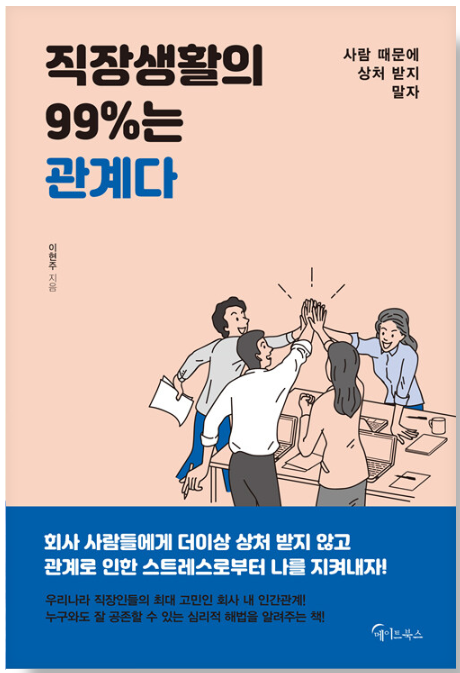

직장생활의 99%는 관계다



1. 상사와의 관계
타인의 행동이 이해가 되질 않는다면 차이를 받아들이는 데 경직된 것은 아닌지 돌이켜보자.
상사라고 해서 반드시 인품이 더 훌륭하다고 볼 수 없다.
하지만 그 사람이 그 위치에 있는 자격이 없다고는 할 수 없다.
모든 것은 이유가 있기 때문이다.

상사는 스승이 아니다.
상사에게 업무 외의 것을 배운다면 그건 단지 운이 매우 좋은 것ㅇ디ㅏ.

직장관계는 업무 종료와 함께 종료된다.
다음 업무 시작과 다시 시작하지만, 업무 시간 외에는 나와 전혀 관련이 없는 사람이기 때문에
스트레스받을 필요가 없다.

상사가 특정 부분에서 너무 까다롭게 군다면 그 부분에서 너무 까다롭게 군다면 그 부분에서
내 영향력은 없었는지 체크하자.
ex)업무납기일을 여러 번 밀림 등..
해당 영역에서 관계의 변화를 원한다면 기꺼이 에너지를 투자해서 해당 부분을 개선하려고 노력해야 한다.

어쩌면 이번 프로젝트에 대해 크게 신경쓰고 있기 때문에 더 예민한 것일수도 있다.

직장생활을 하다보면 주어진 역할 때문에 자신의 견해와는 다른 행동을 해야할 때가 있다.
어쩌면 당신의 상사도 내적으로는 회의감을 느끼고 있을지도 모른다.
그도 조직의 일원인지라 행동을 선택하는데 한계가 있음을 인지하게 되면 100% 그가 원해서 행동하는 것은 아니라는 걸 알게된다.

2. 경쟁할 것인가, 협력할 것인가?
경쟁은 인간이 태어나는 순간부터 시작되어, 평생 겪는 과정이다.
이러한 경쟁에서 항상 이긴다는 것은 불가능한 일이다.
불가능한 일에 대해서 자신을 몰아치고있는 것은 아닌지 돌아볼 일이다.

공평에 대해서.
업무의 공평도를 생각할 때 생각해 봐야할 것.
나는 상대방보다 일을 덜하기 위해 일을 하는가?

공평이란 것은 어느 정도 기간을 놓고 생각해야 하는가?
다음 프로젝트 때에는 상대방이 더 많은 일을 할수도 있고, 그렇다면 직장생활 전반에 걸쳐서는...?

직장에서 나의 목표
1.성과를 인정받는 것
2.연봉을 인상하는 것
->경쟁자와 비교하는 것보다 내 스스로 자기계발을 하는 것이 낫다.
```
솔찍히 남과 비교해봐야 우울해지고, 비참해지고, 비극적이 될 뿐이다..
그 시간에 자기계발을 해서 스스로의 레벨을 올리는 것이 정답..
```

동료와의 관계
서로 공통된 요소에 주목하고, 같은 고민을 나누면서 친밀감을 쌓아갈 때 자신의 경력을 가장 잘 이해하는 친구 중 하나가 될 수 있다.
갈등이 있는 동료라도, 같은 업무를 하다보면 동질감을 느낄 요소가 반드시 있기 마련이다.

상대방의 행동을 해석하고 의미를 부여하는 것이 갈등을 만들 수 있다.
```
내가 성근이를 불편하게 생각하게 된 계기처럼..
사실 지금도 그러고 있지 않는가..
미쿠가 어떤 말과 행동을 할 때마다 거기에 큰 의미부여를 해서 스스로 곡해해서 화가나거나..
그럴 필요가 전혀 없는데 말이다.
안 해준 것에 대해 불평하지 말고, 해준 것에 대해 감사하라.(셀카 보내줘 -> 보내줌 등..)
```
같은 행동에 대해서도 사람마다 받아들이는 것이 큰 차이가 있는데, 대학원을 위해 야근을 하지 않는 사람에 대해서도
"일도 이렇게 힘든데 공부도 열심히 하는구나"라고 생각한다면 긍정적인 인상을 갖게 될 것이다.

특정 행동에 대해 부정적 생각을 갖고 있지 말고, 감정을 표현하지 말고, 행동을 얘기하고 원하는 바를 말하라.

~게 해줬으면 좋겠다.
대학원 안 가는 날은 남아서 좀 더 일을 해줬으면 좋겠다.
```
결국 나도 성격상 상대방을 미워하면 스스로 불편해서 못 견딘다..그러면 어차피 관계는 파국이야
그럴 바에는 그냥 원하고 하지 말았으면 하는 것을 말하는 것이 장기적으로 도움이 된다.
```
성격을 변화시킨다는 것은 상담자가 오랜 시간과 노력을 들여서 이루어내는 쉽지않는 일이다.
직장동료가 하기에는 매우 어려운 일..

3. 무례한 사람들에게 대처하는 법
상대방이 업무를 제대로 하지 않고 책임을 미룬 상황 - 매우 화가 난다.
다만 그 사람이 원래 그런 성격이고, 그런 성격에서 할 수 있는 최선을 한 것임을 생각하자.
그리고 악의/고의로 나를 엿먹이기 위해 한 행동은 아니라는 것을 이해하라.
```
-> 왜? 그래야 내가 스트레스를 덜 받으니까.
나를 위한 것이다. 나는 타인에게 10의 고통을 주고 위해 1의 고통을 감수하는 사람이 아니다.
원만한 인간관계는 결국 "나"에게 큰 도움이 된다.
이러한 나의 태도가 그에게 10의 이득을 안기고, 나에게 1의 이득이 되는 것처럼 보여도 그건 그대로 어떤가.
그리고 원활한 관계로 인해 내가 받지 않는 심리적 스트레스를 생각하면 무조건 상대방을 이해하려고 하는 편이 좋다.
다만 호구를 잡히는 것은 또 다른 문제를 야기할 수 있기 때문에 단호하게 화를 낼 때는 내야할 듯.

성근이를 예로 들어보자.
성근이는 솔찍히 자기가 자란 환경에서 최선의 선택을 한 것이다.
부정적이고, 남을 무시할 수 있다.
왜냐하면 자신이 남들보다 특출난 적이 별로 없었고, 우월감을 느끼는 것은 스스로의 에고를 지키는 방법 중 하나였을 것이다.
그것이 용한이를 무시하고, 엿먹이려는 행동에서 비롯된 것은 아니었다는 것을 나는 안다.

이번 일을 계기로 나는 타인을 더욱 이해하는 사람이 되겠다.
그 사람이 악인이 아니라면, 고의로 해당 행동을 하는 것이 아니라면, 그 사람의 장점을 보려고 노력할 것이고,
그 사람이 자라온 환경에서 최선을 다했다는 것을 이해하려고 할 것이다.
```
남을 이용하는 매우 이기적인 상사.

남을 공감하지 못하는 사람은 안타까운 사람이다.
어린 시절부터의 많은 경험이 그를 그렇게 만든 것.
결국 그 사람의 인생에서 큰 손해를 보고 있을 것...

객관적인 관점에서 보면 분명 비난받아야 마땅한 행동이지만, 그 사람의 인생 관점에서 보면 이유가 있을 수 있다.
```
이는 다른 사람들도 나에게 매우 많이 느낄 것이다.
나는 분명 모자라고 모난 곳이 있다.
다른 사람들은 그런 나를 보고 쟤 왜저러지? 라는 생각을 할 것이다.
하지만 나도 나름의 배경과 이유가 있기 때문에 지금의 행동을 하는 것.
이와 마찬가지로 다른 사람들도 내가 이해하지 못하는 행동을 할 때에는, 인생 전반적에 걸친 이유가 존재한다.
```

나에게 중요한 것은 그 사람을 비난하는 게 아니라, 최대한 내 정신건강을 지키면서 일을 잘 돌아가게 만드는 것이다.

내가 어차피 그 사람과 크게 깊은 관계를 맺을 것이 아니기 때문에, 내가 불편함을 느끼는 표면적인 행동을 다루고 더 바람직한
대안 행동을 제시하는 것은 가능한 일이다.

예를 들어 무책임한 사람에 대해서 그의 무책임을 책망하기 보다는, 객관적인 그의 업무행동에 대해서, 한 달 동안 거래 업체에
몇 번 전화했는지 등을 다루는 게 효과적이며, 감정적 개입을 조금 더 자제할 수 있다.

또한 게으른 태도를 비난하기보다는, 한 다 동안 기한을 어긴 일이 몇 번 있었는지를 다루는 것이 개인의 특성에 대한 비판을 줄이면서 
문제행동을 다룰 수 있는 방법이다.

친근하게 대하다가 감정적인 거리를 두게되면 상대방이 당신을 신뢰하지 않을 수 있다.
기준을 정해서, 일관된 태도로 상대방을 대하는 것이 좋다.

```
내가 가장 크게 개선해야 할 부분..
나는 특정 부분이 마음에 안들면 급격하게 그 사람과 거리를 두려고 한다.
이는 특히 이전에는 관계가 나쁘지 않았던 사람에게는 크게 실망하게 된다.
오히려 기본보다 안좋아지는 것..
차라리 그 사람에 대해 한 번 깊게 생각한 뒤, 내가 허용할 수 있는 범위, 앞으로 어떤 식으로 대할지 선을 정해놓고 
표면적으로는 친절하지만 내 삶의 영역에 들이지 않으면 된다. 괜히 인간으로서도 갑자기 거리를 두면, 원수같은 사이가 될 지도 모른다.
그리고 웬만하면..사람의 장점을 보려고 노력하자.
그리고 용서하려고 노력하자. 용서는 나를 위한 것. 특히 그 사람이 진정으로 반성하고 사과한다면
과거는 지나간 것이기 때문에 현재의 나에게 영향을 미치지 않는다.
사람을 원망하지 말자.
```

4. 분노 다스리기
회의에서 부장이 이사에게 책망당하자 나를 쳐다본 상황.
1.너가 시키는 대로 한 건데 왜 날 보지? 왜 나한테 책임을 떠넘기려고 하지?
2.함께 작업한 팀원이니까 당황스러운 마음을 나누려고 하는구나.
3.그냥 회의실을 둘러보다가 눈이 마주쳤을지도 모른다. 
```
사실 내가 맞다고 생각한 것들이 상대방과 얘기해보면 전혀 다르게 느끼고 다른 생각을 하는 경우가 많다..
특히 부정적인 상황일 때에는 내 주관을 웬만하면 넣지 않는 것이 좋아보인다.
왜냐하면  모든 사람마다 보는 세계가 다르기 때문에, 내가 느끼는 것과 상대방이 생각하는 것이 전혀 다른 경우가 매우 많다.
```
설령 1번이 맞다고 할지라도 그 상황에서 바로 확인할 방법은 없으며 그렇게 받아들이는 것이 가장 나의 분노를 유발하는 선택지이다.

감정은 격양되고 잡으려고하면 어렵다.
전조증상을 빠르게 파악하고 다스려야한다.
자신만의 감정을 다스리는 루틴 만들기..

상대방을 안쓰럽게 생각해보는건..?
계속 신입들을 대리고 화내면서 일하는 거 정말 힘들겠다. 안쓰럽네.

거래처 사람들에게 계속 저렇게 깐깐하게 따지는 거 피곤하겠다.

5. 부안
미래의 나쁜 상황들을 만들어 나를 세워놓는 것은 아닌지..
실제로 그게 일어나도 별 일 아닐 가능성도 높기도 하고..

불안을 다루는 법
긍정적인 결과를 상상하기
긍정적 결과를 예상하면 행동이 좀 더 적극적이 되고 긴장이 조절된다.
자신이 원하는 결과를 이끌어낼 수 있다.

반면 부정적인 결과를 예상하면 미리 포기하거나 자기 패배적인 행동패턴을 보여, 결국에는 자신이 초기 예상했던 부정적인 결과가 나온다.
```
이번에 소스리뷰 받으면서 크게 반성해야 할 부분..
오지도 않을 미래를 상상하며 2일동안 공휴일임에도 불구하고 큰 스트레스를 받았다..
1.일단 일이라는 것은 일이 종료됨과 동시에 사라지는 것이다. 나는 나의 행복을 위해 사는 것이지 일을 위해 사는 것이 아니다.
2.긍정적인 상황을 생각하지 않고 부정적인 상황을 끊임없이 떠올리며 스트레스를 받은 부분은 확실히 고쳐야 할 부분이었다.
```

자신감이 없을 때에는 잘 된 경우를 상상하며 당당하게 하라.

걱정하는 만큼 결과가 심각하지 않으며, 설령 그렇다하더라도 그것이 끝이 아니라 과정의 일부라는 것을 기억하는 것이다.

실패는 끝이 아니라 새로운 도전을 할 새로운 기회이다.

