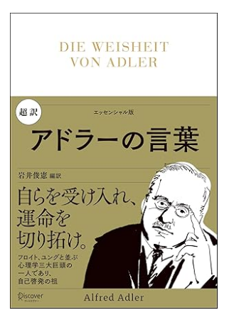

열등감이란 특정분야에서만 눈에 띄고 그 외 분야에서는 발견되지 않을 수 있다.
```
내 인생의 과제는 무엇인가??
나는 무엇을 위해 일본에 와 있는가?
리스트화, 가시화해서 목표를 좇지않으면 의미없는 시간을 보내게 될 뿐이다.
```
## 「働く」ことの意味
### 014 人間は協して仕事をし、役に立とうとする。
共同体感覚は「人間ならではの特性」と称していいだろう。

### 015 価値ある成果を残すために
成功というのは「人間が協力し合えることに役立つかどうか」という視点だ。

```
혼자가 아닌, 협력을 생각할 것.
```

### 016 人生の意味は「貢献」だ
人類の幸福に貢献するやり方で克服する必要がある。
人生の意味とは「貢献」であることを理解する人だけが困難な時に勇気をもって取り込むことができる。

## 人間関係の悩み

### 017 他者に興味をもち、関心を寄せよ
人生を充実に送るためには、他者に興味を持ち、関心を寄せるべきだ。

### 018 一人で生き、似鳥で対処するな
問題に一人対処しようとするな。滅びでしまう。

### 019 