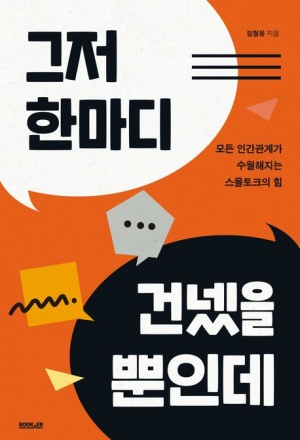

여러 교류회를 나가며 대화를 잘하는 사람이 되고싶다는 생각에서 구매하게 된 책.
실제로 꽤나 대화스킬이 많이 늘고있는 것 같은데..무작정 대화하며 늘리는 것보다는 지침을 공부하며 사용하면 더 좋겠다는 생각이 들어서  읽기 시작했다.

휴게 시간을 통일한 두 번재 팀은 평균 콜 처리 시간이 8%나 단축되었다.
```
- 스몰토크는 업무 효율을 향상시킨다.(물론 일하는 시간에 잡담을 하는 것이 아닌, 휴식시간에 핸드폰만 보는 것 보다는 다른 사람과 대화를 시도하는 게 좋다는 것)
스몰토크 기술이 도움이 될 것이다.
```
첫 번째 자유로운 잡담은 스트레스를 해소합니다.
이는 뇌에 긍정적이고 새로운 자극을 주게 되고 훨씬 더 창의적인 발상을 할 수 있도록 도와줍니다.

두 번째, 건강한 잡담은 인간관계를 개선해 줍니다. 이는 주변의 사회 구성원 중에 많은은 조력자와 선생님을 만드는 것과 같습니다.
타인과의 교류를 통해 시너지가 생기게 되어 사회적으로 성장할 수 있도록 도와줍니다.
그리고 이를 이미 알고 있는 많은 사람들은 타인과의 대화를 자기계발과 도약의 기회로 삼아 효율적으로 살기 위해 노력하고 있습니다.
- 타인과의 교류는 자기계발의 도약 기회이다.

이는 자존감과도 연관이 있습니다. 만약 스스로 부족한 것을 느끼고 있는 상태라면 아는 척하는 것을 참을 수 없겠죠.
자신에 대해 부정적인 생각만 가득하다면 자신이 무언가를 모른다는 사실을 인정하는 것이 괴로운 일이 되겠지요. 그래서 먼저 자신에 대한 믿음과 여유를 가지는 것이 필요합니다.

```
나 뭔가.. 직장에서 용한이나 성근이가 알려줄 때 솔직히 조금은 자존심이 상하지 않았나..?
배움은 나이를 불문하고 후배에게도, 어린 아이에게도 배울 점이 있는 것인데...
내 스스로 자존감이 높다면 배움을 부끄러워하지 않을텐데.
레바논에서도 크게 느꼈지만 타인에게 무언갈 배우려하지 않는다면 발전은 없다
```

눈치를 챈다는 것은 남의 마음을 그때그때 상황으로 미루어 알아내는 것인데, 내가 아는 척을 하면 할수록 상대는 더 이상
정보를 주지 않기 때문에 눈치채는 것이 힘들어집니다. 아이러니하게도 모르는 것을 아는 척하는 데 눈치를 쓰면 점점 더 눈치가 
없어지게 되는 것이지요.

A가 자신의 지식과 경험을 뽐내긴 했지만 결과적으로 A는 전혀 얻는 것도 없고 서로 기분만 상하는 결과가 되었습니다.

성숙한 사람은 모르는 척을 잘할뿐더러 상대가 모르는 것이 있어도 무시하지 않습니다.

반대로 상대에게 관심을 두기로 선택했다면 한동안 불편할 것입니다. 상대가 갑자기 편해지지도 않겠지요.
아마 평소에 하지 않던 일을 해야 하니 많은 에너지를 쏟아야 할 것입니다.
그래서 일단 자신부터 편해지라는 말이 달콤하게 들리며 그냥 살던 대로 살고 싶어질 수도 있을 것입니다.
하지만 변화를 생각한다면 선택한 것을 밀고 나가며 지속적인 훈련을 해야 합니다. 그리고 일단 선택하는 순간
다음 영역인 '서로 불편한 영역'으로 들어가게 됩니다.

이 영역에 있는 사람들이 꼭 기억해야 할 사실이 있습니다.
바로, 스스로의 에너지를 관리해야 한다는 것입니다.
훈련을 목적으로 하더라도 불필요한 인간관계를 너무 많이 가지다 보면 스트레스를 관리하기가 어려워집니다
원래 스트레스는 변화 자체에서 오는 것이기 때문에 발전하는 것조차도 스트레스가 될 수 있습니다.
```
스트레스는 변화 자체에서 오는 것.. 그것이 발전이라도..
그것을 담담히 받아들이고 나아갈 수 있는 사람이 되고 싶다.
```

에너지를 잘 관리하면서 인간관계를 갖다 보면 어느새 상대가 편안함을 느끼는 시점이 올 것입니다.
```
결국 수많은 반복과 시행착오, 시간이 필요한 부분이니 조급해햐지 말것.
```

내가 불편한데 상대를 편하게 해주고 있다는 것은 좋은 연기를 하고 있다는 뜻도 됩니다.
이 연기는 절대 나쁜 것이 아닙니다.
상대가 어떤 말과 행동을 원하는지 눈치로 파악할 수 있고 행동으로 이어지는 것입니다.
다만 연기를 한다는 표현을 하는 것처럼 전에 하던 모습과 다르기 때문에 스스로 불편함을 느끼고 있는 것이지요.
그래서 이 영역에 머무르고 있다면 반드시 기억해야 할 것이 있습니다.
바로 목표를 잊지 말라야 한다는 것입니다.
눈치를 키우고 상대와의 스몰토크를 연습하는 데는 나만의 목적이 있었을 것입니다.

```
불편함과 고통의 상태에서 반드시 잊지 말하야 하는 것은, 내가 왜 이것을 하고 있는가.. 나의 궁극적인 목표를 상기하는 것..
이는 대화의 기술에서 뿐 아니라 모든 것에서 적용이 된다.
간헐적 단식을 할 때에도 스스로 피곤할 때 공부를 하는 것에 대해서도..
일본 생활 중 너무 힘들고 포기하고 싶을 때에도 내 스스로의 목표가 있다면 이겨낼 수 있을 것이다.
```

내가 불편한 것을 참고 이 영역에 머물며 타인을 이해하고 대응하는 훈련을 계속한다면 눈치가 확실하게 생깁니다.
그 눈치가 온전히 자신의 것이 되면 연기하려고 하지 않아도 자연스럽게 해야 할 말과 행동을 하게 되는 순간이 오게 됩니다.
```
고통의 시간을 견디면, 그 것이 체화되어 더 이상 에너지를 사용하지 않고도 당연하게 할 수 있게 된다.
그 시점이 내가 다음 단계로 나아가는 고통을 시작할 수 있는 때이다.
```

'나만 불편한 영역'을 지나는 순간이 옵니다. 그 때 목적이 없이 인간관계를 형성하고 훈련고 있다면 쉽게 좌절하고 자괴감에 빠질 수 있습니다.
```
매우 중요한 말..
그냥 내가 단순히 매일 계획을 세워서 영어공부 일본어공부 IT공부를 한다고 하자.
단순히 목적이 없이 훈련을 하고있는 위의 상황과 똑같다..
결국은 장기적인 목표를 세우고 그 것을 세분화하는 과정에서 해당 목표들이 세워져야한다는 것..
무작정 반복하는 행위는 고통과 좌절을 초래할 뿐이다.
```
그래서 여려분은 각자 목표를 가지고 변화에 임해야 합니다.
과정을 거치면 여러분의 목적을 이룰 수 있는 효율적인 눈치와 그를 통한 자연스러운 스몰토크의 기술이 체득될 것입니다.

인내하지 않고 얻은 편안함은 가장 문제가 심각한 상황이고 인내 후에 얻은 편안함은 최고의 상태가 됩니다.
```
마치 노력 없는 도파민과 같군..
공짜로 얻는 것을 멀리하라..
```

