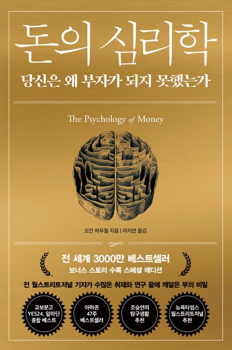

돈의 심리학

이 책의 기본 전제는 다음과 같다.
돈 관리를 잘하는 것은 당신이 얼마나 똑똑한지와 별 상관이 없다.

별 다른 비밀은 없다.
그러는 동안 쥐꼬리만 한 저축이 복리로 불어나 800만 달러가 넘는 돈이 됐다.

대학 졸업장, 교육, 배경, 경험, 연줄 등이 없는 사람이 최고의 교육을 받고 최고의 연줄을 가진 사람보다 훨씬 더 나은 결과를 낼 수 있는 분야가 또 어디 있을까?
그러나 투자의 세계에서는 이런 것이 가능하다.

하나는 금융 성과가 지능, 노력과 상관없이 '운'에 좌우된다는 것이다.
두 번째는 금융 성공은 대단한 과학이 아니라는 사실이다.
>금융은 소프트 스킬이고, 소프트 스킬에서는 아는 것보다 <b>행동</b>이 더 중요하다.

사람들이 왜 빚에 허덕이는지 이해하려면 이자율을 공부할 것이 아니라 탐욕과 불안, 낙천주의(나다... 정신차려야해)의 역사를 공부해야 한다.

# 아무도 미치지 않았다.
당신은 투자에 있어 안전지향적인가, 위험선호형인가?
사람에 따라 왜 이런 차이가 있는가?

두 경제학자가 발견한 사실에 따르면 사람들의 투자 결정은 본인 세대의 경험,
특히 성인기 초기의 경험에 크게 좌우된다고 한다.

"투자자 각자의 위험 선호도는 개인의 경험에 좌우되는 것으로 보인다."

지능도, 교육도 아니었다.
순전히 언제, 어디서 태어났느냐 하는 우연에 좌우될 뿐이다.

```
투자 성향은 개인의 성장시기의 경제상황에 좌우된다.
이는 사상이 바뀌어도 나는 과거의 데이터, 경험을 기반으로 현재 시장을 유추할 가능성이 높다는 것이다.
내 유년시절의 경험에 좌지우지되지 않고 현시를 객관적으로 바라보는 눈이 필요하다..
```

# 어디까지가 행운이고, 어디부터가 리스크일까
겉으로 보이는 것만큼 좋은 경우도, 나쁜 경우도 결코 없다.
시간을 잘 통제할 수 있는 사람이 더 행복한 인생을 사는 경향이 있음을 깨닫는다면 우리도 뭔가 해볼 수 있을지도 모른다.

>누구를 칭송하고 누구를 무시할지 신중하게 결정하라.

모든 성공이 노력 덕분도 아니고 모든 빈곤에 게으름 때문도 아니라는 사실을 꼭 알아두어라.

>특정 개인이나 사례에 초점을 맞추기보다는 더 큰 패턴에 주목하라

개인의 큰 성공은 운이 크게 작용했을 가능성이 매우 높다.


성공한 사람이 있고, 실패한 사람이 있다.
두 사람의ㅣ 투자 결과는 달랐고, 사람들은 이렇게 평했다.
멋있게 대담했다. vs 바보같이 무모했다.
어떤 차이가 있을까?
어디까지가 행운이고, 어디까지가 노력과 재주이며, 어디부터가 리스크일까?
누구도 정확하게 알 수 없다.
다만 확실한 것은 어떤 결과가 100퍼센트 노력이나 의사결정으로 이루어진다고 생각해선 안 된다는 것.

어느 순간 당신 앞에 행운의 지렛대가 움직일지 리스크의 지렛대가 움직일지는 아무도 알 수 없다.

# 결코 채워지지 않는 것
또래들을 넘어서고 싶은 마음은 더 힘들게 노력하는 동력이 될 수 있다.
그러나 '충분함'을 느끼지 못한다면 삶은 아무 재미가 없다. 사람들이 흔히 말하듯이, 결과에서 기대치를 뺀 것이 행복이다.

```
그러면 행복해지는 가장 좋은 방법은
좋은 결과를 내기 위한 엄청난 노력, 능력을 향상시키고, 
기대치는 낮추는 것이 될 것이다..
```
이렇게 다른 사람과 자신을 비교하면 그 천장은 너무 높아서 사실상 아무도 닿을 수 없다.
절대로 이길 수 없는 싸움이다. 유일하게 이기는 방법은 처음부터 싸움을 하지 않는 것이다.
이 정도면 충분하겠다고 받아들이는 것이다.
내가 가진 게 주변 사람들보다 적더라도 말이다.
```
남과 비교하지 말고, 내가 가진 것이 충분하다고 받아들이는 것..
```

>가장 어려운 것은 멈출 수 있는 골대를 세우는 일이다.
스스로 멈추게하는 골대, 즉 목표를 세우는 것, 이는 가장 중요한 일 중 하나이다.

>문제는 남과 비교하는 것이다.

당신이 부자가 되었을 때 다음 네 가지 질문을 던져보라.
하나. 얼마나 더 벌고 싶은가?
둘. 누군가와 비교하고 있진 않은가?
셋. 충분하다고 느끼는가?
넷. 돈보다 중요한 것은 무엇인가?
현대 자본주의는 두 가지를 좋아한다.
부를 만들어내는 것. 부러움을 만들어내는 것.
누구도 여기에서 자유로울 수 없다.
기억하자. 라스베이거스에서 이기는 유일한 방법은 들어가자마자 나가는 것이다.

# 시간이 너희를 부유케 하리니
>어마어마한 결과를 가져오기 위해 반드시 어마어마한 힘이 필요한 것은 아니다.

작은 것이 불어나면, 그러니까 작은 성장이 미래 성장의 동력 같은 역할을 하게 되면, 그 출발점이 거의 논리를 거부하는 것처럼 보일 정도로 비상한 결과를 낳을 수 있다.
너무나 비논리적이기 때문에 무엇이 가능하고, 어디서 성장이 만들어지고, 어떤 결과를 낳을 수 있는지 과소평가하게 된다. 돈도 마찬가지이다.

```
정말 큰 메시지를 담고 있다..
작은 것은 반드시 불어난다.
근데 그것은 작은 것 그 자체로만은 안되고, 수 많은 작은 것이 쌓인 후 
시간이 지나야 불어나게 된다..
마치 눈덩이와 같이, 특정지점까지는 사소해보일지라도 그것이 쌓이게 되면 계단식의 성장을 하게 된다.
오늘의 1시간을 허투루 하지 말거라..
오늘의 1시간이 5년 뒤의 3시간, 4시간임을 기억하라.
오늘 1시간을 투자하면 미래 나의 시간 3시간을 투자한다고 생각하고 임하라..
```

사람들은 언제나 최고 수익률을 원한다.
그러나 오랜 시간 성공을 '유지'한 사람들은 최고 수익률을 내지 않았다.
그들은 꾸준한 투자율을 보였다.
오랫동안 괜찮은 수준의 수익률을 유지하는 것이 훨씬 더 나은 결과를 낳는다.
그러니 '닥치고 기다려라.'

시간의 힘이, 복리의 힘이 너희를 부유케 할 것이다.

# 부자가 될 것인가, 부자로 남을 것인가

>파국은 피해야 한다. 무슨 일이 있더라도.

부자로 남는 방법은 하나뿐이다. 
겸손함과 편집증이 어느 정도 합쳐져야 한다.

번 돈의 적어도 일부는 해운의 덕이므로 과거의 성공을 되풀이할 거라 믿지 말고, 겸손한 태도를 가질 필요가 있다.

>파산하지만 않는다면 결국엔 가장 큰 수익을 얻는다.

강세자엥서 현금을 들고 있으면 보수적으로 보이고, 스스로도 그런 느낌이 든다.
그 훌륭한 자산들을 소유하지 않음으로 인해 내가 포기하는 수익이 얼마인지 예리하게 의식하게 되기 때문이다.
현금이 1년에 1퍼센트를 번다면, 주식 수익률은 10퍼센트다.
이 9퍼센트의 격차 때문에 매일이 괴롭다.

그러나 바로 그 현금 덕분에 약세장에서 주식을 팔지 않아도 된다면, 그 현금으로 인한 실제 수익률은 연간 1퍼센트가 아니라 그 몇 배일 수 있다.

좋지 않은 시기에 절박함 때문에 어쩔 수 없이 주식을 파는 일을 한 번 막는 것이, 크게 성공할 주식 수십가지를 고르는 것보다 평생 수익률에는 더 큰 도움이 될 수 있다.

```
예) 하락장이 되어 내가 산 주가보다 떨어진 상태에서, 급전이 필요하게 된 경우
어쩔 수 없이 손해를 보고 팔아야 함. ->무조건 손해

하락장이지만 내가 산 주가보다는 비싼 경우 -> 무조건 이득 

그러면 강세장에는 몰빵하고, 차익실현을 한 다음에 불확실한 상황이 생기면 현금으로 들고있으면 되는 거 아닌가..? ->그러면 약세장 진입 시 추가 매수도 가능하고,,

확실히 현금을 들고있으면 약세장에 돌입했을 때 크게 추가 이득을 볼 수 있긴 하겠다.

근데 S&P500은 샀다 팔았다하는건 큰 의미가 없다..
큰 게 올 때에 잠깐 팔았다가 다시 사기 or 레버리지로 사기는 의미가 있을 지도.
```
계획이란 현실에서 살아남을 수 있을 때에만 쓸모가 있다.
그리고 알 수 없는 일로 가득한 미래야말로 누구나 맞닥뜨릴 현실이다.
좋은 계획은 이런 험준한 현실을 애써 아닌 척하지 않는다.
좋은 계획은 이 사실을 온전히 받아들이고 오류의 여지를 강조한다.
계획 속의 구체적 요소들이 모두 맞아떨어져야한다면 그만큼 경제생활은 위태롭다는 뜻이다.
```
이 건 경제 계획 뿐 아니라 모든 계획이 마찬가지이다..
결국 인생 전체에 걸쳐서 반복하고 있듯이,
매우 빡빡한 계획을 세워서 달성하지 못하고 다음 계획까지 좌절하며 시간을 낭비하느니, 주식과 같이 적당한 수익률을 길게 가는 것이 무조건 이득이다..
무조건 버퍼를 두고 안전하게 계획을 세워야 한다는 것..
```
