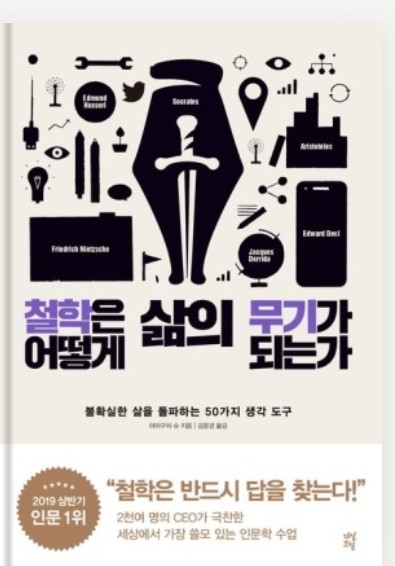

철학은 어떻게 삶의 무기가 되는가

- 교양 없는 전문가야말로 우리의 문명을 가장 위협하는 존재다.
- 전문 능력이 있다고 해서 교양이 없거나 매사에 무지해도 되는 것일까?

우리는 왜 철학을 배워야만 하는가
- 상황을 정확하게 통찰한다.
- 비판적 사고의 핵심을 배운다.
```
직면한 문제는 다를지라도 비즈니스맨은 철학을 배움으로써 자기 행동과 판단을 무의식중에 규정하고 있는 
암묵적인 전제를 의식적으로 비판하고 고찰하는 지적 태도와 관점을 얻을 수 있다.
```
- 어젠다를 정한다.
```
어젠다는 과제이다.
과제를 정하는 일은 혁신의 출발점이다.
수많은 혁신가들은 처음부터 혁신을 하겠다! 라고 하고 마음 먹은 것이 아니다.
그들은 '구체적 목표'를 먼저 정하고 그것을 해결하기 위해 최선을 다한 사람들이다.
```
과제를 잘 설정하기 위해서는 ?
'교양'에 있다. 눈앞에 펼쳐진 익숙한 현실로부터 과제를 선택해 끌어내려면 반드시 상식을 상대화해서 볼 줄 알아야 한다.
지리적인 공간이나 역사적인 시간의 폭을 넓은 시야로 볼 줄 아는 사람일수록 눈앞의 상황을 객관적으로 바라볼 수 있다는 점이다.
(다양한 경험을 하고 다양한 장소에 가보고, 역사와 철학을 반드시 배워야 하는 이유..)
상식을 깨는 것이 혁신인데, 모든 상식을 의심하면 일상생활이 불가능 할 것이다.
교양을 통해 의심해야할 상식과 넘어가도 좋은 상식을 구분하는 힘을 길러야한다.

- 같은 비극을 되풀이하지 않는다.\
과거 수많은 철학자가 동시대의 비극을 마주할 때마다 인간의 어리석음을 고발하고 같은 비극이 두 번 다시 되풀이되지 않도록 어리석음을 극복하는 방법을 고뇌하고 이야기하고, 또 글로 남겼다.\
인류는 지금까지 비싼 수업료를 지불하고 다양한 실패를 경험하며 교훈을 얻었다.

# 1부 무기가 되는 철학

철학에서 왜 좌절하는가

- 물음의 종류 What과 How
- 배움의 종류 프로세스와 아웃풋

세상은 무엇으로 이루어져 있는가? = What의 물음\
우리는 어떻게 살아가야 하는가? = How의 물음

What의 물음에 대한 대답은 시시한 것이 많다.
(고대 철학자들의 현상에 대한 탐구는 현대인의 관점에서 볼 때 잘못된 것이 많기 때문.)

### 중요한 것은 과정에서 배운다.
- 프로세스로부터의 배움
- 아웃풋으로부터의 배움

프로세스는 철학자가 최정적인 결론에 이르기까지의 사고 과정과 문제 설정 방법을 가리킨다.

아웃풋은 철학자가 논고의 마지막 부분에서 최종적으로 제안한 해답이나 주장을 말한다.
- 물론 아웃풋으로부터 현대인이 배울 것은 거의 없다.
- 하지만 프로세스는 현대를 살아가는 우리에게도 큰 자극이 될 만한 신선한 가르침이 있다.

# 2부 지적 전투력을 극대화하는 50가지 철학/사상 
## 1장 '사람'에 관한 핵심 콘셉트 : 왜 이 사람은 이렇게 행동할까?

### 타인의 시기심을 관찰하면 비즈니스 기회가 보인다.

```
프리드리히 니체
독일의 철학자이자 고전 문헌학자. 현대에는 실존주의의 대표적인 사상가로 유명하다.
박사 학위도 교원 자격증도 없는 채로 스물네 살의 젊은 나이에 ㅅ위스 바젤 대학교의 고전 문헌학 교수로 초빙되었지만 첫 번째 책인 [비극의 탄생]이 학회로부터 무시당한 데다 건강상의 문제까지 겹쳐 대학을 사직한 후에는 재야의 철학자로 일생을 보냈다. 니체의 문장은 독일어 산문의 걸작으로 손꼽혀 독일에서는 국어 교과서에도 자주 실린다.
```

르상티망 : 약한 입장에 있는 사람이 강자에게 품는 질투, 원한, 증오, 열등감 등이 뒤섞인 감정. 시기심.

여우와 신포도에서 여우는 손이 닫지 않는 포도에 대한 분한 마음을 자신의 생각을 '저 포도는 시다.'라고 바꿈으로서 해소한다.

```
마치 부자를 시기하며 부자는 악인이다 라고 생각하는 사람들이지 않은가.
또한..인기를 가진 사람들을 시기하며 예쁜 여자들은 성격이 나쁠것이야 라고 생각하는 나와같지 않는가..ㅠㅠ
```

이러한 점에서 니체는 우리가 가지고 있는 본래의 인식 능력과 판단 능력이 르상티망에 의해 왜곡될 가능성이 있다고 지적했다.

르상티망에 사로잡힌 개인은 그 상황을 해결하기 위해 다음과 같은 반응을 보인다.
- 르상티망의 원이이 된 가치 기준에 예속, 복종한다.
- 르상티망의 원인이 된 가치판단을 뒤바꾼다.

이 두 가지 반응 모두 우리가 자신답고 풍요로운 인생을 보내는 데 큰 저해 요인으로 작용할 수 있다.

1. 르상티망의 원이이 된 가치 기준에 예속, 복종한다.

고급 브랜드 상품이 이에 해당한다.
매년 새로운 모델을 선보여 새로운 르상티망을 꾸준히 만들어낸다.
르상티망에는 제조원가가 업기 때문에 아이디어만 있다면 원하는 만큼 얼마든지 만들어 낼 수 있다.

현대인은 유독 '평등'에 민감함 감각을 가지고 있어서 약간의 차이에도 르상티망을 품게 될 가능성이 있다.
그렇게 만들어진 르상티망은 상징을 구입하는 형태로 해소되는데, 그리하여 명품 판매실적은 경제 저성장 사회에서도 상승세를 그린다.

하지만 이러한 현태로 르상티망을 계속 해소한다고 해도 '자신다운 인생'을 살아가기란 쉽지 않다.\
르상티망은 사회적으로 공유된 가치판단에 자신의 가치판단을 예속 또는 종속시킴으로써 이루어진다.\
자신이 무언가를 원할 때, 그 욕구가 '진짜' 자신의 순수한 마음에서 비롯된 것인지 혹은 타인이 불러일으킨 르상티망에 의해 가동된 것인지를 판별해야 한다.

2. 르상티망의 원인이 된 가치판단을 뒤바꾼다.

니체는 대표적인 예로 기독교를 들었다.
고대 로마 시대에 로마 제국의 지배 아래 있던 유대인은 줄곧 빈곤에 허덕이며, 부와 권력을 쥔 로마인을 선망하면서도 증오했다.
하지만 현실적으로 우위에 서기 어려웠던 그들은 복수를 위해 신을 만들어내
'로마인은 풍요로운데 우리는 가난으로 고통받고 있다. 하지만 천국에 갈 수 있는 것은 우리 쪽이다.' 부자와 권력자들은 신에게 미움받고 있어서 천국에는 갈 수 없다.'는 논리를 세웠다.
신이라는 로마인보다 상위에 존재하는 가공의 개념을 창조함으로써 현실 세계의 강자와 약자를 반전시켜 심리적인 복수를 꾀한 것이라고 설명한다.

이는 르상티망의 원인이 된 열등감을 노력이나 도전으로 해소하려 하지 않고 열등감을 느끼는 원천인 '강한 타자'를 부정하는 가치관을 끌어내 자신을 긍정하려 한 사고관이다.

