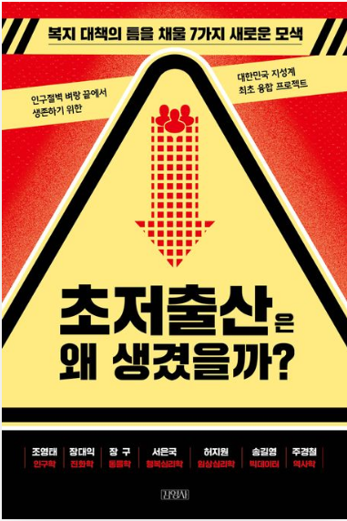

# 모색 1
## 현재 저출산 현상은 자연스로운 본능의 결과
장대익 진화학자 

### 저출산은 인간이 환경에 적응한 결과

인구 밀도가 높은 환경에서
섣부른 출산은 비효율적 의사결정입니다.

경쟁이 치열하다고 느끼는 사람들은 이른 나이에 출산을 할 이유가 없습니다.
그들에게는 출산을 미루고 자신의 성장에 자원을 투자해 본인의 경쟁력을 높이는 것이 더 좋은 전략이기 때문입니다.
우리는 우리 사회가 얼마나 경쟁적이라고 지각하는가?

인구 밀도가 높은 국가의 국민일수록 성적인 엄격성이 높은데, 다시 말해 아기를 낳을 수 있는 짝짓기에 매우 신중한 태도를 취한다는 것이죠.

또한 또다른 번식 보다는 이미 출산한 저녀의 성장에 투자한다.
결과적으로 인구 고밀도 국가의 출산율은 상대적으로 더 낮습니다.

경쟁이 심하다고 지각하는 순간 사회적 공격성과 공격의 욕구가 증가하며, 사람들이 중요하다고 생각하는 목표와 가치가 획일화되기 시작합니다.
가령 sky대학에 들어가는 게 하늘의 별따기구나 라고 경쟁 지각을 하게 되면, 경쟁을 포기하거나 다른 대안을 찾기보다는 그 목표를 위해
더 매진하려는 욕망에 사로잡히는 것입니다. 그러면 어떤 결과가 생기나요? 일자리는 점점 더 줄어들고 경쟁은 더 치열해집니다.

### 경쟁에 대한 심리적 밀도를 줄여야한다.
정부는 왜 실패했는가?
저출산 관련 예산 가운데 대략 70퍼센트를 보육 환경 개선에 집행했다.
```
1.보육환경 개선은 다자녀 출산에 도움이 되는가?
2.무자녀 부부가 체감하지도 못하는 출산환경 개선이라는 것은, 아이를 낳고싶은 동기부여가 되는가?
```
->경쟁에 대한 지각을 줄여주는 데 예산을 사용했는가?가 더 중요한 것.


# 모색 2
## 콜라, 딸기우유, 탕후루가 저출산 원인?
장구 수의사

저출산을 야기하는 생물학적 원인을 규명하기 위해 많은 과학자가 노력해왔습니다.
'저출산'을 과학적으로 살펴보면, 불임과 난임으로 구분할 수 있습니다.

생물학적으로 보면, 오늘날 저출산 현상에는 난임이 어느 정도 기여하고 있고, 이를 해결하기 위해 여러 분야의 과학자들이 오랫동안 연구를 수행하오고 있습니다.

<b>불임</b>은 유전적으로, <b>난임</b>은 생식세포는 정상이지만 주변 환경 때문에 임신이 잘되지 않는 현상을 말합니다.
환경 변화 또는 대사성 질병으로 난소나 정소의 기능이 일시적으로 손상되면 난임이 생깁니다.

지속적이고 과도한 탄수화물 섭취로 인한 대사성 변화(비만)
과도한 당 섭취, 탄산음료 및 혼합 음료

```
자제하자 성일아.. 
과도한 탄수화믈, 당, 탄산음료..
내 몸을 갉아먹고 있는 것이다..
```

과도한 탄수화물에 노출된 아이들이 성인이 되면 불임이나 난임으로 고통받을 확률을 간과할 수 없습니다.

지금은 사회문화적, 경제적 요인에 가려저 있는 생물학적 요인이 
저출산의 주요한 원인으로 대두될 수 있는 것입니다.
지금부터라도 작은 실천을 통해 대비해야 한다고 생각합니다.

남성의 고환은 체온보다 1, 2도 낮아야 정자가 정상적으로 유지되는데, 장시간 앉아서 일하는 남성은 그 조건을 충족하기 어렵습니다.
```
중간중간에 계속 서서 해라..
휴식도 좀 하고..
```
정자는 이론적으로 반영구적 보존이 가능.

사람에게 출산과 새로운 가족의 탄생은 더 큰 감동의 원천일 것입니다.
앞서 살펴본 저출산 요인에 대한 자극적인 대처가 필요한 이유가 바로 여기에 있습니다.
```
인간에게 아이란 본능적으로 큰 행복을 주는 것이구나..
```

# 모색 3
## 행복감, 아이를 세상에 착륙시킬 활주로
서은국 행복연구권위자

### 자연에 반역하는 인간 
큰 그림에서 본다면, 현재의 저출산 문제도 인간의 막강한 뇌가 자연에 반해 행사하는 일종의 '반역'에서 기인하는 현상입니다.
좋고 나쁨을 떠나, 진화 과정에서 설계된 행동의 흐름을 자기 의지로 끊을 수 있는 능력을 인간이 행사하고 있다는 뜻이에요.

### 밥상 차리는 감성, 수저 얹는 이성
인간도 정말 중요한 결정은 무의식적이고 감정적인 수준에서 처리하고, 
이성적 생각은 큰 방향이 정해진 뒤 거기에 그럴듯한 설명을 붙이는 경우가 많다는 사실이 밝혀졌습니다.
이미 사랑에 빠진 뒤 상대의 장점을 손꼽아보는 모습과 비슷합니다.
이때 상대방이 좋은 이유를 차분히 생각해서 조목조목 나열해보도록 하면, 이 커플은 오히려 헤어질 가능성이 더 높아질 수도 있습니다.
```
생종본능에 근거한 감정은 이성을 앞선다.
즉, 이성적으로 생각했을 때 말도 안되는 일이 일어날 수 있다.
```
인간의 결정과 선택에 강력한 힘을 발휘하는 것은 사실 생각보다 감정입니다.
이유와 논리는 감정이 내린 선택을 그럴듯하게 포장하는 역할을 하는 경우가 많습니다.
그러나 이런 감정의 위력을 우리는 잘 의식하지 못해요.
그래서 논리와 합리적 생각이 우리의 행동을 지배한다고 착각합니다.
그렇지만 어쩌면 정작 선택의 밥상을 차려놓은 것은 감정적 느낌이고, 여기에 슬며시 수저를 올려놓는 것이 이성일 수 있습니다.
우리가 의식을 하든 못하든 감정적 경험은 우리 일상에 막대한 영향력을 행사하는데, 거기에는 그럴 만한 이유가 있습니다.
감정은 긴 진화의 여정에서 습득한 생존 지혜를 담고 있기 때문입니다.

인간의 뇌에 전체 에너지의 20퍼센트를 사용합니다.

뇌는 많은 일을 하지만 한계가 있기 때문에,
어떤 의사 결정을 할 때 모든 정보를 분석해서 판단하는 것은 불가능하다. 또한 어떨 때에는 상충되는 정보가 공존한다.
제한된 시간과 정보속에서 신속성을 갖추는 것은 인간의 생존과 직결되어있었기 때문에, 중요한 의사결정에 감정이 크게 영향을 미쳐왔다.

먼 미래를 염두에 두며 
장기적인 계획을 세우거나
익숙하지 않은 환경에 가서 새로운 자원을 개척하기 위해서는 
긍정 정서 경험이 필요합니다.

불안하고 염려로 가득 찬 마음은 큰 그림을 볼 여유가 없습니다.

당장은 없어도 되지만, 먼 훗날 반드시 필요한 자원을 탐색하고 준비하는 노력은 여유와 즐거움이 있는 마음 상태로부터 시작된다는 것입니다.

```
내 인생의 이정표를 그리고, 미래를 대비하며 나아가는 것은
나에게 여유와 즐거움이 있을 때 이구나..
내가 눈앞의 현실에 매몰되어 살아간다면, 시간이 지나도 상황은 개선되지 않고 오히려 나를 옥죄어올 것이다..
여유가 없다면 만들고 억지로 있는 시늉을 하라.
```

큰 기둥부터 세우고 나머지 빈 공간에 작은 소품을 채우겠다는 생각을 할 때,
그리고 내일이 아닌 30년 뒤의 삶을 생각할 때, 자녀의 필요성과 의미에 대해 생각해보게 되겠지요.
이러한 이유로 행복감과 출산은 관련이 있습니다.
```
정말 맞다. 자녀를 갖지 않겠다는 것은 
먼 미래를 고려해서라기 보다는 당장 잃을 것이 너무 많아지니까...
지금의 내가 여유가 없으니까..
```

그래서 행복은, 간단히 말한다면 긍정 정서를 경험하게 만드는 모든 자극, 상황, 기억, 혹은 미래 기대의 총합이라고 볼 수 있습니다.
긍정적인 느낌이 무엇 때문에, 왜 유발되었든, 이 '좋은 느낌'을 자주 경험하는 사람일수록 행복감이 높다고 볼 수 있습니다.
```
이 좋은 느낌은 내가 마음먹기에 정말 달려있는 것이다..
사소한 것에 행복감을 느끼기 시작하고, 매사에 감사하면 나는 행복한 사람이 될 수 있는 것이다.
```
학계에서 행복을 측정하는 논리도 이를 따릅니다.
응답자가 얼마나 자주 긍정적인 정서와 만족감을 경험하는지 측정하고, 그 수치를 바탕으로 행복감이 높고 낮은 사람을 구분합니다.

이런 즐거움이 빈번하다는 것은 현재 자신의 삶에 큰 문제나 위협이 없다는 뜻입니다.
즉, 아이를 인생에 착륙시킬 활주로가 확보되어있다는 뜻이지요.

행복감이 높은 사람들이 낮은 사람들보다 결혼하고 5년 안에 아이를 낳을 확률이 높다고 합니다.

우리 행복의 아킬레스건은 경제적 겹핍이 아닌 사회적 부의 결핍에서 옵니다.

타인의 삶을 함부로 평가하지 않는 것. 그저 서로 다른 삶을 각자 사는 것뿐이데, 주제넘는 참견을 하지 말자는 것이죠.

"좋은 엄마가 되려면 단지 좋은 사람이기만 해서는 부족하다. 행복한 사람이 되어야 한다."

나는 좋은 사람, 행복한 사람인가?


# 모색 4
## 비혼과 비출산은 어쩌면 잠시 쉬어가는 방식
허지원 임상심리학자

좌절을 극복하게 하는 회복탄력성은 어이러니하게도 좌절 경험에서 나온다.
-> 지금 극복하지 않으면 또 찾아오게 되어있다.
좌절이 지금 당장 맞서 싸워 이겨야 하는 우리의 목표 그 자체일 필요는 없습니다.
대신 적절한 수준으로 심신이 가라앉았다가 꽤 괜찮은 속도로 행동의 기저선을 회복하면 됩니다.
일단 먹고, 씻고, 자고, 노는 행동들의 기저선만 회복된다면 이후에 천천히 목표 지향적인 행동에도 노력을 기울일 수 있습니다.
그러다 우연한 기회가 내 앞에 왔을 때 이를 놓치지 않으 수 있을 정도의 에너지 수준을 회복하게 되지요.
->좌절/우울을 극복하는 방법 : 기본 행동의 최저선을 회복한 뒤, 천천히 천천히 목표 행복을 할 수 있도록 한다.

### 최적의 좌절 경험
'최적의 좌절 경험' : 내 마음대로 되는 일도 있고, 되지 않는 일도 있구나를 알게 되는 것.
우리의 회복탄력성을 높일 수 있는 것은 최적의 좌절 경험이다.
우리의 자아를 크게 손상시키지도 않고, 여러 문제 해결을 시도해볼 수도 있다.
성공하면 좋지만 혹 실패한다 해도 시간이 흐르면 그럭저럭 아무는, 성장을 위해 필요했던 자잘한 좌절 경험.

모든 갈등이 바로바로 해소 된다는 것은 버티는 능력을 계발할 기회를 잃는다는 것이다.
->무조건 편한게 좋은 것이 아니다. 나를 계발할 기회를 잃게 되는 것이다.

스트레스 : 예측 가능성 / 통제 가능성

회복탄력성과 문제 해결력은 자잘한 스트레스 상황에 한동안 덩그러니 놓인 개인들이 이를 타개할 여러 대처 방안을 능동적으로 
고민하는 과정에서 발달합니다.

그간 강화를 받기 위해 노력해야 하는 시기가 너무 길었고,
그 강화물도 우리의 삶과 자존감을 획기적으로 바꿀 만한 것인 아니라는 사실을 알게 되면서부터,
오랜 시간 노력을 기울여야 하거나 감정적인 피로감이 예측되는 일에 우리가 손을 놓고 있는 시간은 점차 길어졌습니다.
```
사회적으로 노력의 허들이 너무나도 높아져버렸고, 보상마저 확실하지 않다.(=회피하고 싶은 욕구↑)
```
긴 터널을 막 빠져나온 시점에서 반려자를 찾는 데는 큰 에너지가 필요하기 때문입니다.
실제로 좌절을 감내할 회복탄력성도 충분치 않은 상태이고요.
이런 상태를 소진이라는 용어로 설명하기도 하지요. 통제하기 어려운 환경, 공평함이나 공정함을 기대하기 어려운 상황에서 
주위의 지지없이 오랫동안 홀로 버텨야 하는 경우, 사람들은 감정적으로도 지치고 신체적 에너지도 고갈되는 것입니다.
너무 지쳐 소진된 상태에서는 우울, 무력감, 절망스러운 혼란을 경험하며, 이 시기가 길어지면 비관적이거나 냉소적이 되어 새로운 행동을 개시하거나
꾸준한 노력을 투입하기가 어려워집니다.

감정표현불능증은 10명 중 1명 수준
본인이 경험하는 감정이 어떤 감정인지 잘 모르겠다고 말합니다.

개인이 자기 감정을 인식하거나 표현하는 일이 불가능했던 폭력적인 환경에 오랫동안 노출되거나 기질적으로 정서적 자극에 쉽게 압도되는 경우, 방어기제를 발현하기 때문.

무쾌감증은 더 이상 즐거움이나 기쁨을 경험하지 못하는 상태.
깊은 우울증을 겪는 사람들에게 흔한 증상.

아무 죄도 없는데 죄지은 것처럼 해동하는 사람들도 있고.(난데..)


'세상이 이렇게 살기 힘든 곳인데 내가 이 아이를 이 세상에 내놓는 건 잘못이 아닐까?'
저는 그냥 제가 할 수 있는 만큼 아이에게 최선을 다하면 그뿐인데, 아이의 인생을 제가 책임져야 할 것만 같은
지나친 자의식이 죄책감으로 이어지고 있었던 것을 그때는 몰랐던 것이죠.
```
그럼 내가 낳은 아이의 인생을 책임지지 않아도 된다는 건가..?

챗 GPT의 답변
그 문장에서 말하고자 하는 바는,
**“부모가 아이의 인생 전체를 통제하고 책임져야 한다는 과도한 자의식”**은 결국 부모 자신을 지치게 하고,
때로는 아이에게도 무언의 부담이 될 수 있다는 거예요.

즉, 부모가 해줄 수 있는 건 아이의 삶을 설계하거나 보장하는 게 아니라,
그 아이가 자기 삶을 건강하게 선택하고 살아갈 수 있도록 도와주는 것,
예를 들면:

애정과 존중을 주고

실패해도 괜찮다고 말해주고

스스로 판단하고 선택할 수 있는 힘을 길러주는 것

이런 것들이 부모가 감당해야 할 ‘책임’에 더 가깝지 않을까 생각해요.


과연..
나와 형만해도 부모님이 인생을 책임져주지 않았다.
엄마는 책임을 지려고 부단한 노력을 했었지만 자식이라는 것은 부모의 마음대로 되지 않았고,
자신의 자아대로 행동하고 자신이 원하는 길을 가버렸다.

그 과정에서 통제를 원했던 엄마와는 길이 틀어져버렸다..
만약 엄마가 내 삶을 '책임'지려하지않고 내가 가는 길을 응원하고 조언자의 역할을 했다면 어땠을까?
나와 형은 결국 방치한 것마냥 자신의 길을 찾아가버렸다.
우리가 원했던 건 내 삶을 책임져주는 강압적인 길이 아닌, 우리를 지지해주고 응원해주는 부모였다.
그래서 영훈이 어머니가 항상 지지해주는 걸 보며 부러워 했었지..

자식이란 건 결국 부모 마음대로 되는 것이 아니기 때문에 
애정과 존중, 실패에 대한 응원, 스스로 판단할 힘을 길려주는 것
이 핵심적인 거구나.. 완벽한 부모, 완벽한 책임을 느끼며 부담을 가질 필요가 없었다.
```

부모는 그저 최적의 좌절을 제공할 최상의 상태를 유지하면 되빈다.
예상되는 장애물들을 미리 제거해두고 아이의 욕구가 언제나 즉각 충족될 수 있는 무균실과 같은 환경을 제공해주는 것은
아이가 결국 스트레스에 취약해지는 결과를 낳습니다.

그러니 너무 많은 책임감과 완벽주의적 기대를 가지고 출산과 비출산을 결정하지는 말아주세요.

그럭저럭 좋은 개인 혹은 그럭저럭 좋은 부부와 같은 모습을 젊은 세대에게 보여주고 기다리는 것이 자연스러운 태도 변화를 가져올 것입니다.

아이가 깊은 수준의 자기 통찰을 할 수 있으며 회복 탄력성과 유연성을 갖춘
꽤 괜찮은 성인으로 자라는 과정에서, 부모의 불완전함은 아이에게 좋은 시험대를 제공해줄 것입니다.
즉 좋은 주 양육자는 '그럭저럭 괜찮은 엄마'면 됩니다.

# 모색 5
## "엄마처럼 살기 싫다" 빅데이터가 알려주는 청년세대의 속마음 
송길영 마인드 마이너(소셜 미디어에 남긴 흔적을 그러모아 관찰하며 왜 그렇게 살게되었는지를 유추하는 일)

엄마가 해주던 빨래는 빨래방이 해주고, 엄마가 차려주던 생일상은 배달 앱이 대신합니다.
'엄마의 아웃소싱'이 시작된 것입니다.
전통적으로 주부 역할을 하던 엄마의 일들을 대신 맡아서 하는 새로운 사업이 빠르게 성장하고 있습니다.

지난 세월 남서에게 편중되었던 가족에 대한 부양 의미가 양성 평등의 사회로 발전하며 남녀 모두에게 나누어지면서, 
'먹여 살리는 일'을 해왔기에 그래도 가정 내에서 대접받았던 아빠의 위상도 예전 같지 않습니다.
```
그럼 남자는 먹여살리는 일이 아니라면, 무엇으로 가족에게 인정을 받는건가?
```

50대 남성의 자살률은 여성 대비 3.6배나 됩니다.
```
아빠한테 잘해야겠다..
더 연락 자주해야겠다.
```

1997년 전체 이혼 중 9.7%이던 결혼 20년 이상 부부의 이혼은 2017년 31.2퍼로 3배 이상 증가했다.

은퇴 시점에 이 문제가 두드러지게 된 것은 지금껏 서로의 삶이 바빠 좀처럼 같이 시간을 보내지 못했던 두 사람이 온전히 둘만 남아 
많은 시간을 보내면서 생기는 갈등에서 기인한다.
```
근데 피를 나눈 가족이라도 같은 지붕 밑에서 계속 살면 갈등이 생기는데,
은퇴 부부는 오죽하겠나. 주말 부부가 현명한 것이다.
```
남자는 경재력이 없어져 이혼당한다고 생각하고, 여성은 이미 애정과 관심이 없어진 결혼생활에 불만을 느끼고 있었지만 여러 이유로 참아왔다.
(아마 자녀, 금전문제겠지. 그러면 결국 경제력때문에 이혼당하지 않았었다는 말이 틀린 건 아니다. 근본적 원인은 아니지만 억제기 역할은 하고 있었던 것.)

### 가족 이야기
자식입장에서 예전화 다르게 효도를 대하는 인식이 자랑스러움 -> 부담으로 바뀌면서, 자기 자신조차 자식에게 그런 것을 기대하지 않게 되었다.
그에 따라 과거에는 '자식농사'라고 불리었던 양
