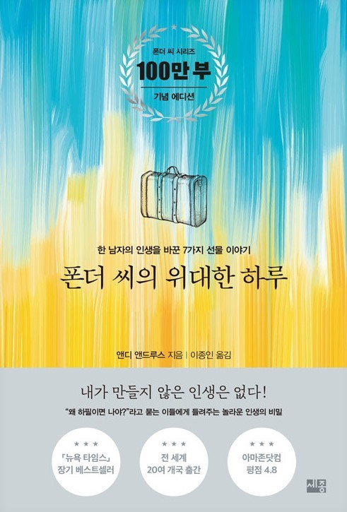

평생을 회사에 헌신한 폰더씨는 구조조정을 당하고, 가장으로서 설자리가 없어졌다고 생각하며 인생이 끝났다고 생각한다.
이 때 과거의 위인들을 차례로 만나며 성공한 사람들의 삶을 대하는 마음가짐을 하나씩 배우게 된다.

앞으로 '그건 내 잘못이 아니야!'라는 말은 절대로 해서는 안된다.
```
모든 것은 나의 선택으로 인해 야기되었다.
```

불평은 라디오를 듣는 것처럼 하나의 행동다.
사람들은 라디오를 들을 수도 있고, 끌 수도 있다.
그와 마찬가지로 불평을 선택할 수도 있고, 불평하지 않기를 선택할 수도 있다.
나는 불평하지 않는 쪽으로 선택하겠다.

"폰더 씨, 우리의 인생은 선택에 의해 만들어지는 거예요.
먼저 우리가 선택을 하고, 그 다음에는 그 선택이 우리에게 영향을 미치지요. 살기가 좀 불편한 곳?
그래요. 고마워할 줄 모르는 사람이라면 그렇게 말하겠지요.
이 비좁은 곳에서 여덟 명이 살고, 음식은 너무 무자라거나 맛이 업고, 여자애 둘이서 옷 세벌을 나눠 입어야하니까요.
하지만 고마워하는 것도 역시 선택이에요.
다른 유대인들이 철도 수송 차량에 끌려가는 동안 우리는 이 별채에 안전하게 숨어 있어요.
미에프의 가족인 자기들에게 나온 배급 카드를 아껴서 우리가 먹을 음식을 가져다줘요.
입을 옷이 전혀 없이 벌거숭이인 사람에 비해 언니와 나는 여벌의 옷 하나가 더 있어요.
저는 이 모든 것에 대하여 감사함을 느끼기로 선택했어요. 저는 불평하지 않을 것을 선택했어요.
```
지금의 내가 매우매우 배워야하는 자세..
나는 엄청나게 축복받은 환경에 있고, 또 매우 많은 것을 가지고 있는데, 가지지 못한 것, 부족한 것,
불편한 소수의 것에 초점을 맞춰서. 혹은 남과 비교해서 행복해지기를 선택하는 것이 아닌,
불행해지는 것을 선택하고 있는 건 아닌지...
모든 것은 내가 가진 것에 초점을 맞추고 감사하는 마음에서 나온다.
```
기분이 나쁠 때면, 저는 그 즉시 행복한 사람이 되겠다고 선택해요. 사실 그게 제가 매일 아침 잠에서 깨어나면 선택하는 첫 번째 선택이에요.
'오늘 나는 행복한 사람이 될 것을 선택하겠다'라고 거울을 보며 큰 소리로 말해요.


폰더 격언

# 성공을 위한 첫번째 결단

## 공은 여기서 멈춘다.

지금 이순간부터 나는 나의 과거에 대하여 총체적인 책임을 진다.
나는 지혜의 시작이 내 문제에 대한 책임을 받아들이는 것임을 안다.
내 과거에 대하여 책임을 짐으로써 나는 나 자신을 과거로부터 해방시킬 수 있다.
내가 스스로 선택한 더 크고 밝은 미래로 나아갈 수 있다.
나는 앞으로 나의 현재 상황에 대하여 그 누구에게도 책임을 전가하지 않겠다.
나의 교육 배경, 나의 유전자, 일상생활의 다양한 여건이 나의 미래에 부정적인 영향을 주지 않도록 하겠다.
내가 성공하지 못한 이유를 이런 통제하기 어려운 힘들에 미룬다면, 나는 과거의 거미줄에 사로잡혀 영원히 빠져나오지 못할 것이다.
나는 앞을 내다보겠다. 나의 과거가 나의 운명을 지배하도록 내버려두지 않겠다.
공은 여기서 멈춘다.
나는 내 과거에 대하여 모든 책임을 진다.
나는 내 성공에 대해서도 책임을 지겠다.
내가 오늘날 심리적으로, 육체적으로, 정신적으로, 재정적으로 된 것은 내가 선택한 결과이다.
나의 결단은 언제나 나의 선택에 의해 좌우된다.
나는 나의 사고방식을 바꿈으로써 늘 적극적인 방향을 지향하고, 파괴적인 방향은 거들떠보지도 않겠다.
나의 마음은 미래의 해결안을 응시하고, 과거의 문제에는 더이상 집착하지 않겠다.
나는 이 세상에 긍정적인 변화를 가져오려고 애쓰는 사람들과 사귀려고 노력하겠다.
나는 편안한 것만을 추구하는 사람들과 어울려 편안한 것만 추구하는 방식은 철저히 배제하겠다.
결단을 내려야 할 상황이 되면 반드시 결단을 내리겠다.
하느님께서 나에게 늘 올바른 결단을 내릴 수 있는 능력을 주셨다고 생각하지 않는다.
하지만 일단 결단을 내리는 능력과, 또 잘못된 결단을 내렸을 경우 그것을 시정하는 능력은 주셨다고 생각한다.
감정의 기복에 따라 나의 정해진 노선을 벗어나는 일은 결코 없을 것이다.
일단 결단을 내리면 끝까지 그것을 밀어붙일 것이다.
나의 모든 정성을 기울여 그 결단 사항을 실현하려할 것이다.
공은 여기서 멈춘다.
나는 내 생각과 내 감정을 통제한다.
앞으로 "왜 하필이면 나지?"라는 질문을 던지고 싶을 때면, 즉각 "나에게는 안된다는 법이 어디 있나?"라고 답변하겠다.
도전은 하나의 선물이고 또 배울 수 있는 기회이다.
역경이 찾아오면 나는 그것을 해결해야할 문제로 생각하지 않겠다.
단지 선택해야 할 문제가 있을 뿐.
내 생각은 명료하므로 올마른 선택을 할 수 있을 것이다.
역경은 위대함으로 가는 예비 학교이다.
나는 이 예비학교에 입학한다. 나는 멋진 일을 해내고 말겠다!
나는 나의 과거에 대하여 총제적 책임을 진다.
나는 내 생각과 내 감정을 통제한다.
나느 내 성공에 대하여 책임을 진다.
공은 여기서 멈춘다.

# 성공을 위한 두번째 결단
## 나는 지혜를 찾아나서겠다
오늘 나는 지혜를 적걱적으로 찾아 나서겠다
나의 과거는 결코 바꿀 수 없지만, 오늘 내 행동을 바꿈으로써 나의 미래를 바꿀 수 있다.
나는 오늘 당장 나의 행동을 바꾸겠다!
나의 인간관계에 긍정적인 변화를 가져오게 하고, 또 나의 동료들을 더 잘 이해하게 해주는
책과 자료들을 열심히 읽고 듣겠다.
회의와 공포를 자극하는 자료는 더 이상 내 마음 가까이 두지 않겠다.(유튜브, 인스타, 댓글 등..)
나는 난 자신의 능력과 미래에 대한 나의 신념을 굳건하게 해준느 것들만 읽고 또 듣겠다.
나는 지혜를 찾겠다.
나는 조심스럽게 내 친구들을 선택하겠다.
내가 닭을 친구로 사귄다면 나는 땅을 후벼 파며 빵 부스러기를 쪼아먹는 법을 배울 것이다.
만약 독수리와 벗핟나면 나는 하늘 높이 나는 법을 배울 것이다.
나는 독수리다. 하늘 높이 나는 것이 나의 운명이다.
나는 지혜를 찾을 것이다.
나는 현명한 사람들의 조언에 귀 기울일 것이다.
현명한 사람의 조언은 메마른 땅에 내리는 빗방울과도 같다.
현명한 조언을 무시하는 사람은 비가 내리지 않은 풀잎과 같아서 곧 시들어버릴 것이다.
현명한 사람과 의논함으로써 나는 그의 지식과 경험을 빌려올 것이다.
그리하여 내 성공의 가능성을 크게 높일 것이다.
나는 지혜를 찾겠다. 나는 다른 사람들에게 봉사하는 사람이 되겠다.
내가 겸손한 자세로 남들에게 봉사하면 그들의 지혜를 저절로 얻게 될 것이다.
때때로 봉사정신을 발휘하는 사람은 아주 엄청난 부자가 되기도하고, 그 사람 자신이 왕이 되기도 한다.
왜냐하면 백성들은 그런 사람을 즐겨 왕으로 뽑기 때문이다.
가장 많이 봉사하는 사람이 가장 빨리 성장한다.
나는 겸손하게 봉사하는 사람이 되겠다.
나는 누군가가 나를 대신하여 문을 열어주기를 바라지 않는다.
오히려 누군가를 위해 문을 열어주는 사람이 되겠다.
나를 도와주는 사람이 아무도 없을 때에도 나는 실망하지 않겠다.
오히려 남을 도와줄 기회가 생기면 그것을 기쁘게 받아들이겠다.
나는 남들에게 봉사하는 사람이 되겠다.
나는 현명한 사람의 조언에 귀 기울이겠다.
나는 조심스럽게 친구들을 선택하겠다.
나는 지혜를 찾아 나서겠다.

### 나는 행동하는 사람이다.
오늘부터 나는 새로운 나를 창조함으로써 새로운 미래를 만들겠다.
나는 낭비한 시간, 잃어버린 기회를 아까워하며 절망의 구렁텅이에 빠지지 않겠다.
과거의 일은 아무리 사소한 것이라도 바꿀 수 없다. 하지만 나의 미래는 곧 다가온다.
나는 미래를 양손으로 움켜쥐면서 적극적으로 미래를 개척해나가겠다.
아무것도 하지않는 것과 뭔가 해야 하는 것 중 하나를 선택하라면, 나는 늘 행동하는 쪽을 선택하겠다.
나는 이 순간을 잡는다. 지금을 선택한다.
나는 행동하는 사람이다. 나는 언제나 활발하게 행동하는 습관을 들일 것이고, 늘 미소를 잊지 않을 것이다.
나의 정맥 속으로 흘러드는 생명의 피는 행동과 성취를 향하여 더 멀리, 더 높이 나아가라고 권유한다.
게으른 자에게는 부와 변영이 따라오지 않는다.
나는 행동하는 사람이다. 나는 리더이다. 리드하는 것은 행동하는 것이다.
리드하기 위해 나는 앞으로 움직여나가야 한다.
늘 달리는 사람에게는 많은 사람들이 길을 비켜준다.
나의 행동은 나를 따르는 사람에게 성공의 파도를 일으킨다.
나의 행동은 한결같을 것이다.
이것은 나의 리더십에 자신감을 불어넣어준다.
나는 행동하는 사람이다. 나는 결정을 내릴 수 있다.
그것도 지금 당장.
왼쪽으로도 오른쪽으로도 움직이지 않는 사람은 평범한 사람이 될 수밖에 없다.
하느님은 나의 행동을 기다리고 계신다.
하느님은 나에게 정보를 수집하여 분류하는 머리와 결론에 도달하는 용기를 주셨다.
나는 결정을 잘못 내릴 것을 두려워하는 우유부단한 사람이 아니다.
나의 체질은 강인하고, 나의 앞길은 분명하다.
성공하는 사람은 재빨리 결정을 내리고 자신의 마음을 천천히 바꾼다.
반대로 실패하는 사람은 결정을 천천히 내리고 마음을 재빨리 바꾼다.
나는 빨리 결정을 내리고, 그것은 나를 승리로 이끌어준다.
나는 행동하는 사람이다. 나는 과감하다. 나는 용감하다.
이제 내 인생에서 두려움은 더 이상 발붙일 자리가 없다.
나는 두려움이 증기같은 것이라고 생각하며, 그것이 다시는 내 인생을 짓누르도록 내버려두지 않겠다.
나는 실패를 두려워하지 않는다.
실패는 그만두기를 좋아하는 사람에게나 있는 것이다.

#### 나는 단호한 마음을 가지고 있다.
어떤 현자가 말했다. "천 리 길도 한 걸음부터." 이 말이 진실이라는 것을 알기 때문에 
나는 오늘 한 걸음을 떼어놓는다. 너무 오랫동안 내 발은 망설여왔다.
바람의 풍향을 살피면서 왼쪽으로 갈까 오른쪽으로 갈까, 뒤로 갈까 앞으로 갈까 망설였다.
바람이란 무엇인가. 사람들의 비판 비난, 불평은 모두 바람의 요소이다.
하지만 바람의 풍향 따위는 나에게 아무런 영향도 미치지 못한다.
방향을 결정하는 힘은 나에게 있다.
오늘 나는 그 힘을 행사하겠다.
나의 길은 결정되었다.
내 운명은 내가 개척한다.
나는 단호한 마음을 가지고 있다. 나는 미래의 비전에 대하여 열정을 가지고 있다.
나는 아침에 눈을 뜰 때마다 새날에 대한 흥분과 성장과 변화의 기회를 생각한다.
내 생각과 행동은 앞으로만 나아갈 뿐, 의심이 깊은 삼림이나 자기연민의 혼탁한 모래밭에 빠져들지 않는다. 
나는 미래의 비전을 다른 사람들에게 스스럼없이 알려주고, 그들이 내 눈에서 나의 신념을 보고 나를 따르게 만든다.
나는 밤에 침대에 누을때면 오늘 하루 나의 길 앞에 놓인 산 같은 장애를 거의 다 치웠다고 생각하며 행복한 피곤함 속에서 잠을 청한다.
내가 잠이 들면 낮 동안에 나를 사로잡았던 꿈이 어둠 속에서 다시 나를 찾아온다.
그렇다. 나에게는 꿈이 있다. 그것은 위대한 꿈이다.
나는 그 꿈을 꼭 잡고 놓치지 않겠다. 만약 내가 그걸 놓친다면 내 인생은 끝장날 것이다.
나의 희망, 나의 희망, 나의 열정, 나의 미래 비전은 나의 존재를 지탱하는 힘이다.
일단 꿈을 꾸어야 꿈을 실현시킬 수 있다. 꿈이 없는 사람은 성취도 없다.
나는 단호한 마음을 가지고 있다. 나는 기다리지 않겠다.
이제 나는 단호한 마음으로 결정을 내린다.
나느 두려움이 없다. 나는 이제 앞으로 나아갈 뿐 뒤를 돌아보지 않는다.
내가 내일로 미루는 일은 결국 모레로 미루어지게 된다.
나는 시가능ㄹ 끌지 않는다. 내가 가지고 있는 모든 문제는 그것을 직접 대면하는 순간 축소된다.
내가 조심스럽게 엉겅퀴를 잡는다면, 그 가시가 나를 찌를 것이다.
하지만 있는 힘을 다해 힘껏 움켜쥔다면, 그 가시는 바스러져 먼지가 되고 말 것이다.
나는 기다리지 않겠다.
나는 미래의 비전에 대하여 열정을 가지고 있다.
나의 길은 결정되었다. 내 운명은 내가 개척한다.